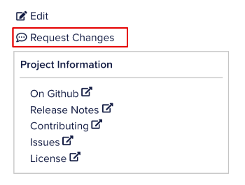
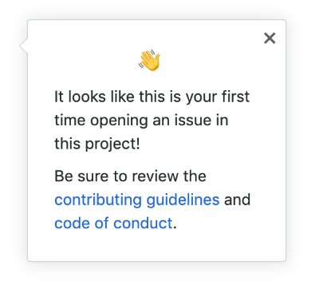

# Get Involved with EOSIO Documentation!

We appreciate your interest in contributing to the EOSIO platform documentation! We always welcome contributions from our community to make our docs better.

## How to Contribute

You can either submit a Pull Request for quick edits or file a new docs issue.

### Quick Edits
Quick edits allow for faster reporting of minor content issues from typographical errors to omissions.

Most of the pages on the EOSIO developer portal provide an **Edit** link which redirects you to the source file on Github. If you don't see the **Edit** button on the documentation page, that means the specific page is not available to be changed.

To make a quick edit:

1. Go to the specific page where you have identified an editorial need and click the **Edit** icon at the top right of the page.

2. Fork the repository to suggest changes. Click **Fork this repository**.

[[note | Note]]
| If you are not signed in to your Github account, it will redirect you to the Github login page. Sign in with your username and password to continue. If you are new to Github, create a new account.

3. Make the suggested changes in the web editor using Markdown syntax. Click the **Preview changes** tab to see the preview of the content.
4. After suggesting your changes, scroll down to the bottom on the page. Enter a title and a description of the changes you made and click **Propose file change**.
5. Create a ***Pull Request*** by entering a title and a description. Click **Create pull request** to submit your suggestion to us.

[[note | Note]]
| If you are new to Github, see [About Pull Requests](https://help.github.com/en/github/collaborating-with-issues-and-pull-requests/about-pull-requests) for more information.

Congrats! You have submitted your suggestion. Our team will review your pull request and merge it if it's a valid change.

### Filing a Docs Issue
Filing an issue in a docs repository means reporting a documentation bug in the form of a Github issue.

To file a new issue:

1. Go to the specific page where you have identified an area of improvement and click **Request Changes** at the top right of the page.
   
2. You will be directed to the Issues tab of the specific repository with an editable Issue form.

   

[[note | Note]]
| If you are not signed in to your Github account, it will redirect you to the Github login page. Sign in with your username and password to continue. If you do not have a Github account, create a new account.

3. Enter the issue title and describe the issue with a proposed solution if you have using Markdown syntax.

[[note | Note]]
| If you are filing an issue for the first time, review the contributing guidelines of the repository.

   
4. Click **Submit new issue** to submit the issue to the repository.

[[Important]]
| We expect and appreciate all contributions to conform to the EOSIO Code of Conduct.
