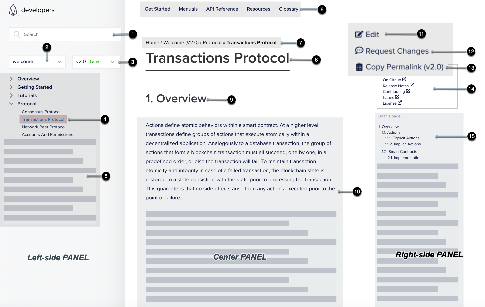

# Portal Page Layout 

The pages on the _EOSIO Developers Portal_ are designed to reflect a 3-panel layout design to improve content readability and overall portal usability. An example portal page renders as shown below: 

*Fig 1. A standard 3-panel layout*

To get familiar with the 3-panel layout of a portal page, see the descriptions below that are mapped to the numbered labels in _Fig 1. A standard 3-panel layout_. 

## Left-side Panel

The left-side panel occupies the vertical area at the left of a given page that includes the following UI elements:

* **(1) Search Field**: A global search field with typo-tolerance support. See Portal Search for more details. 
* **(2) Repository Selector**: A dropdown to select repo-based documentation.
* **(3) Repository Version Selector**: A drop-down to select version-specific documentation. 
* **(4) Current Page**: The current page displayed in the center panel. 
* **(5) Content Navigation Pane**: A navigation pane to access all the documentation topics in the selected repository. 

## Center Panel
The center panel occupies the center area of a given page that includes the following UI elements: 

* **(6) Top-level navigation**: A static navigation bar available on all pages of the portal that contains the core content categories.
* **(7) Breadcrumb navigation**:  A page trail to indicate the current location and to trace your way back.
* **(8) Current page subtitle**: The subtitle of the current page displayed
* **(9) Current page subtitle**: The subtitle of the current page displayed
* **(10) Content display area**:  The consumable documentation content

## Right-side Panel
The right-side panel occupies the vertical area at the right of a given page that includes the following UI elements: 

* **(11) Edit**: Submit a Pull Request (PR) to the selected Github repository
* **(12) Request Changes**: File a new issue in the selected Github repository
* **(12) Copy Permalink**: The permanent URL to the current portal page that will not expire. You can use this link to share with others or bookmark it for later reference.
* **(13) Github Links**: Links to resources in Github related to the selected repository
* **(14) On-page navigation**: A secondary navigation panel to navigate through the other sections of the **(4) Current Page**.

[[info | Note]]
| For detailed instructions on using the Edit button the Request Changes button, the Get Involved section of the EOSIO Developers Portal.

## Responsive Design

To build a great user experience on tablets, mobile devices, and desktops, we have implemented a responsive design layout. Clicking the menu button will expand to show the same options on a desktop view. The below screen shows responsive design in action.

*Fig 2. Responsive design in action*

# Content and Site Navigation

Home Page

The **Home** page of the developers portal is refactored into logical groupings around topics such as getting started, learning about the EOSIO stack, API reference, and helpful developer resources. 

Below is a screenshot of the Home page:

## Repo-based Content Switching 
The Developers Portal processes multiple source repositories in Github and produces documentation content. The **Repository selector** (See **(2)** in *Screen 1.0: A standard 3-panel layout*) on the left-side panel of a portal page allows convenient access to repo-based documentation.

### Switch Repo-based Content Repositories
**To switch between content repositories:**

1. On a given page, click the repository selector dropdown.
2. Select a repository from the list. 

*Fig 3. Switching between content repositories in action*

### Switch Repo-based Content Versions
**To select a repository version:**

1. On a given page, click on the repository version selector dropdown. 
2. Select an available version of the repository.

*Fig 4. Switching repo-based content versionsn in action*

# Portal Search 

The EOSIO Developers Portal integrates the Algolia DocSearch application into the search feature, which provides a professional search experience with highly relevant search results. An example search result from the developers portal is shown in the below screenshot:

*Fig 5. Sample search result page*
