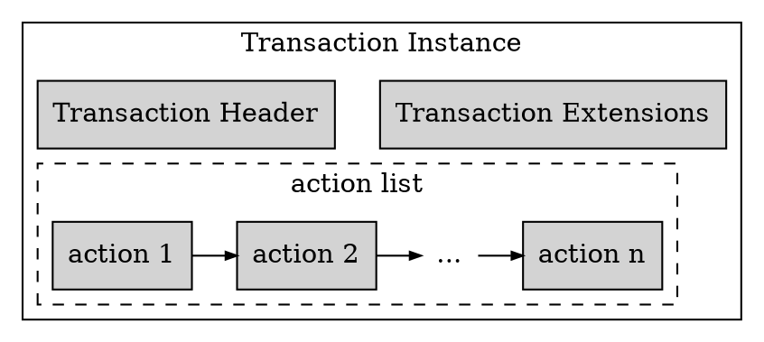
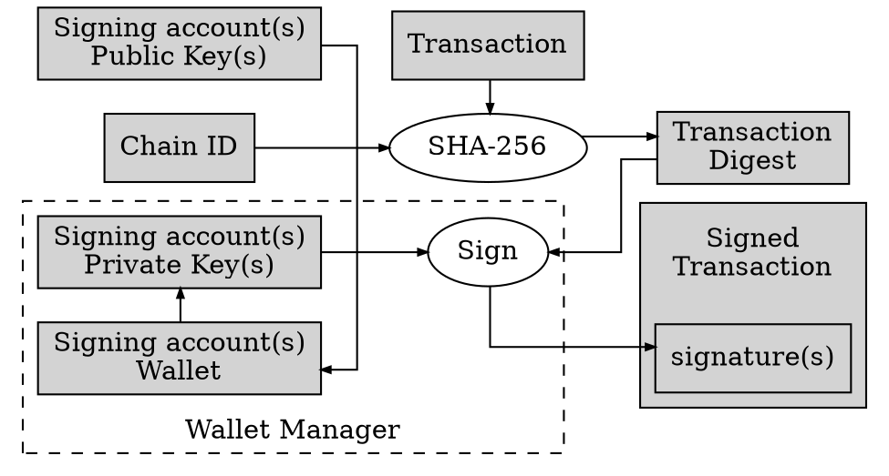
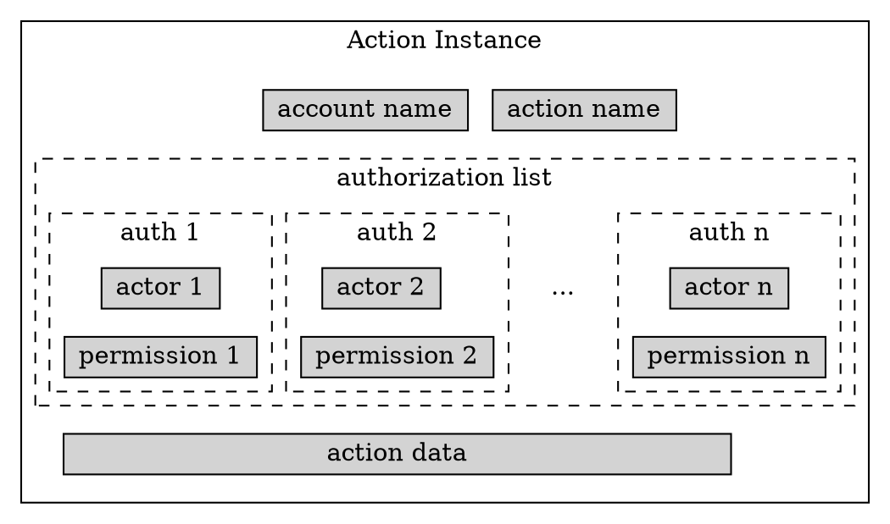

# 1. Overview

Actions define atomic behaviors within a smart contract. At a higher level, transactions define groups of actions that execute atomically within a decentralized application. Analogously to a database transaction, the group of actions that form a blockchain transaction must all succeed, one by one, in a predefined order, or else the transaction will fail. To maintain transaction atomicity and integrity in case of a failed transaction, the blockchain state is restored to a state consistent with the state prior to processing the transaction. This guarantees that no side effects arise from any actions executed prior to the point of failure.

## 1.1. Actions

An action can be authorized by one or more actors previously created on the blockchain. Actions can be created explicitly within a smart contract, or generated implicitly by application code. For any given `actor:action` pair there is at most one explicit associated minimum permission. If there are no explicit minimum permissions set, the implicit default is `actor@active`. Each actor can independently set their personal minimum permission for a given action. Also, a complex but flexible authorization structure is in place within the EOSIO software to allow actors to push actions on behalf of other accounts. Thus, further checks are enforced to authorize an actor to send an action (see [3.4.2. Permission Check](#342-permission-check)).

There are two types of actions involved in a transaction. They mainly differ in the way they are executed by the EOSIO software:

1. Explicit actions, which are present in a signed transaction (see [2. Transaction Instance](#2-transaction-instance)).
2. Implicit (inline) actions, which are created as a side effect of processing a transaction.

Implicit (inline) actions are also defined in smart contract code, just like explicit actions. The key difference is that inline actions are not included in the actual transactions propagated through the network and eventually included in a block; they are implicit.

### 1.1.1. Explicit Actions

Regular or explicit actions, as their name implies, are included in the actual list of actions that form a transaction. Explicit actions are encoded as action instances (see [3.4.3. Action Instance](#343-action-instance)) before being pushed into the transaction. Explicit actions also contain the actual payload data, if any, associated with the action to be executed as part of the transaction.

### 1.1.2. Implicit Actions

An implicit (inline) action is generated as a result of an explicit caller action within a transaction (or another inline action, if nested) that requires that implicit action to perform an operation for the caller action to continue. As such, inline actions work within the same scope and permissions of the caller action. Therefore, inline actions are guaranteed to execute within the same transaction.

## 1.2. Smart Contracts

In EOSIO, smart contracts consist of a set of actions, usually grouped by functionality, and a set of type definitions which those actions depend on. Therefore, actions specify and define the actual behaviors of the contract. Several actions are implemented in the standard EOSIO contracts for account creation, producer voting, token operations, etc. Application developers can extend, replace, or disable this functionality altogether by creating custom actions within their own smart contracts and applications. Transactions, on the other hand, are typically created at the application level. Smart contracts are agnostic to them.

### 1.2.1. Implementation

An EOSIO smart contract is implemented as a C++ class that derives from `eosio::contract`. Actions are implemented as C++ methods within the derived class. Transactions, on the other hand, are generated dynamically (as transaction instances) within an EOSIO application. The EOSIO software processes each transaction instance and keeps track of its state as it evolves from creation, signing, validation, and execution.

# 2. Transaction Instance

A transaction instance consists of a transaction header and the list of action instances and transaction extensions that make the actual transaction. The transaction header includes information necessary to assess the inclusion of the transaction in a block based on its expiration time, which is computed when the transaction is pushed for execution. Other fields include the block number that includes the transaction, a block ID prefix used to prevent "cross chain" or "cross fork" attacks, upper limits for CPU and network usage, and the number of seconds to delay the transaction, if applicable. The diagram below depicts a transaction instance.

The action instances may consist of regular actions or context free actions. Signatures are created and validated at the transaction level. Accounts and permissions are handled on a per action basis. Each action instance contains information to validate whether it is authorized to be executed based on the permission levels of the actors specified in the action and the actual authorizations defined in the smart contract for that action (see [3.4.2. Permission Check](#342-permission-check)).

## 2.1. Transaction ID

A transaction instance contains the minimum set of fields that distinguish one transaction from another. Consequently, a transaction ID consists of a cryptographic hash of the basic fields included in a transaction instance. Therefore, the transaction ID is solely determined by the list of actions encapsulated within the transaction, the transaction header, and any embedded transaction extensions, which are optional. The transaction instance can be further specialized into a signed transaction instance or a packed transaction instance.

## 2.2. Signed Transaction Instance

A signed transaction extends the basic contents of the transaction schema to include the signature(s) generated by the account(s) that signed the transaction. It also includes any data associated with the context free actions, if any, that were included in the transaction instance (see `signed_transaction` schema below). A transaction is not ready for execution and validation unless it is signed by the applicable actors.

### signed_transaction schema

Name | Type | Description
-|-|-
`expiration` | `time_point_sec` | the time the transaction must be confirmed by before it expires
`ref_block_num` | `uint16_t` | lower 16 bits of a block number in the last $2^{16}$ blocks
`ref_block_prefix` | `uint32_t` | lower 32 bits of block id referred by `ref_block_num'
`max_net_usage_words` | `unsigned_int` | upper limit on total network bandwidth billed (in 64-bit words)
`max_cpu_usage_ms` | `uint8_t` | upper limit on total CPU time billed (in milliseconds)
`delay_sec` | `unsigned_int` | number of seconds to delay transaction for
`context_free_actions` | array of `action` | list of context-free actions if any
`actions` | array of `action` | list of [action instances](#343-action-instance)
`transaction_extensions` | `extensions_type` | extends fields to support additional features
`signatures` | array of `signature_type` | digital signatures after transaction is signed
`context_free_data` | array of `bytes` | context-free action data to send if any

## 2.3. Packed Transaction Instance

A packed transaction is an optionally compressed signed transaction with additional housekeeping fields to allow for decompression and quick validation. Packed transactions minimize space footprint and block size in the long run (see `packed_transaction` schema below). A packed transaction forms the most generic type of transaction in an EOSIO blockchain. Consequently, when transactions are pushed to a block, they are actually packed transactions whether compressed or not.

### packed_transaction schema

Name | Type | Description
-|-|-
`signatures` | `signature_type` | digital signatures after transaction is signed
`compression` | `compression_type` | compression method used
`packed_context_free_data` | `bytes` | compressed context-free data (if transaction compressed)
`packed_trx` | `bytes` | compressed transaction (if compressed)
`unpacked_trx` | `signed_transaction` | cached decompressed transaction
`trx_id` | `transaction_id_type` | transaction ID

The `unpacked_trx` field holds the cached unpacked transaction after the transaction instance is constructed. If the signed transaction was previously compressed, it is decompressed from the `packed_trx` field and cached to `unpacked_trx`. If the signed transaction was stored uncompressed, it is simply copied verbatim to `unpacked_trx`. The `signatures` field allows a quick signature validation of the transaction without requiring a full decompression of the transaction.

# 3. Transaction Lifecycle

Transactions go through various stages during their lifespan. First, a transaction is created in an application or an EOSIO client such as cleos by pushing the associated actions into the transaction. Next, the transaction is sent to the locally connected node, which in turn relays it to the active producing nodes for validation and execution via the peer-to-peer network. Next, the validated transaction is pushed to a block by the active producer on schedule along with other transactions. Finally the block that contains the transaction is pushed to all other nodes for validation. When a supermajority of producers have validated the block, and the block becomes irreversible, the transaction gets permanently recorded in the blockchain and it is considered immutable.

## 3.1. Create Transaction

Transactions are created within an application by instantiating a transaction object and pushing the related action instances into a list within the transaction instance. An action instance contains the actual details about the receiver account to whom the action is intended, the name of the action, the list of actors and permission levels that must authorize the transaction via signatures and delays, and the actual message to be sent, if any (see `action` schema below).

### action schema

Name | Type | Description
-|-|-
`account` | `name` | encoded 13-char account name
`action_name` | `name` | encoded 13-char action name
`authorization` | array of `permission_level` | list of `actor:permission` authorizations
`data` | `bytes` | action data to send

After the transaction instance is created at the application level, the transaction is arranged for processing. This involves two main steps: signing the transaction and pushing the signed transaction to the local node for actual propagation and execution of the transaction. These steps are typically performed within the EOSIO application.

## 3.2. Sign Transaction

The transaction must be signed by a set of keys sufficient to satisfy the accumulated set of explicit `actor:permission` pairs specified in all the actions enclosed within the transaction. This linkage is done through the authority table for the given permission (see [Accounts and Permissions: 3. Permissions](40_accounts_and_permissions.md#3-permissions)). The actual signing key is obtained by querying the wallet associated with the signing account on the client where the application is run.

The transaction signing process takes three parameters: the transaction instance to sign, the set of public keys from which the associated private keys within the application wallet are retrieved, and the chain ID. The chain ID identifies the actual EOSIO blockchain and consists of a hash of its genesis state, which depends on the blockchain’s initial configuration parameters. Before signing the transaction, the EOSIO software first computes a digest of the transaction. The digest value is a SHA-256 hash of the chain ID, the transaction instance, and the context free data if the transaction has any context free actions. Any instance fields get serialized before computing any cryptographic hashes to avoid including reference fields (memory addresses) in the hash computation. The transaction digest computation and the signing process are depicted below.

After the transaction digest is computed, the digest is finally signed with the private key associated with the signing account’s public key. The public-private key pair is usually stored within the local machine that connects to the local node. The signing process is performed within the wallet manager associated with the signing account, which is typically the same user that deploys the application. The wallet manager provides a virtual secure enclave to perform the digital signing, so a message signature is generated without the private key ever leaving the wallet. After the signature is generated, it is finally added to the signed transaction instance.

## 3.3. Push Transaction

After the transaction is signed, a packed transaction instance is created from the signed transaction instance and pushed from the application to the local node, which in turn relays the transaction to the active producing nodes for signature verification, execution, and validation. Every producing node that receives a transaction will attempt to execute and validate it in their local context before relaying it to the next producing node. Hence, valid transactions are relayed while invalid ones are dropped. The idea behind this is to prevent bad actors from spamming the network with bogus transactions. The expectation is for bad transactions to get filtered and dropped before reaching the active producer on schedule. When a transaction is received, no assumption is made on its validity. All transactions are validated again by the next producing node, regardless of whether it is producing blocks. The only difference is that the producer on schedule attempts to produce blocks by pushing the transactions it validates into a pending block before pushing the finalized block to its own local chain and relaying it to other nodes.

## 3.4. Verify Transaction

The process to verify a transaction is twofold. First, the public keys associated with the accounts that signed the transaction are recovered from the set of signatures provided in the transaction. Such a recovery is cryptographically possible for ECDSA, the elliptic curve digital signature algorithm used in EOSIO. Second, the public key of each actor specified in the list of action authorizations (actor:permission) from each action included in the transaction is checked against the set of recovered keys to see if it is satisfied. Third, each satisfied `actor:permission` is checked against the associated minimum permission required for that `actor:contract::action` pair to see if it meets or exceeds that minimum. This last check is performed at the action level before any action is executed (see [3.4.2. Permission Check](#342-permission-check)).

### 3.4.1. Transaction Context

Once the public keys are recovered, a transaction context is created from the transaction instance. The transaction context keeps track of the trace of actions and the action receipt generated as each action is dispatched and executed. All state generated is kept within a transaction trace instance and a list of action receipts. The transaction trace consists of a list of action traces. Each action trace contains information about the executed action, which includes the action receipt, the action instance, whether it is a context-free action, and the transaction ID that generated the action. The action receipt is generated later during transaction execution and finalization.

### 3.4.2. Permission Check

Since the sequence of actions contained in the transaction must be executed atomically as a whole, the EOSIO software first checks that the actors specified in each action have the minimum permission required to execute it. To that end, the software checks the following for each action:

*   The named permission of each actor specified in each action instance.
*   The named permission of the corresponding `actor:contract::action` pair specified in the smart contract.

If there is at least one actor whose set of named permissions fail to meet the minimum permission level required by the corresponding `actor:contract::action` pair in the smart contract, the transaction fails. The reason why action permissions are checked before any action is executed is due to performance. It is more efficient to cancel a transaction with all actions unexecuted, than doing so after a few actions executed, but later were rolled back as a result of a failed action or authorization. Any state changes incurred during a failed action must be undone to preserve data integrity. Database sessions are expensive in terms of memory usage and computing resources. Therefore, undo operations must be minimized as possible.

### 3.4.3. Action Instance

The diagram below depicts an action instance. It consists of the receiver account, the action name, the list of actors and their permissions, and the action data containing the message to be sent, if any, to the receiver account.

### 3.4.4. Authority Check

After the minimum permission levels are checked, the authority table for the receiver account’s permission that matches each actor’s permission within the action instance is checked (see [Accounts and Permissions: 3. Permissions](40_accounts_and_permissions.md#3-permissions) for more details).

## 3.5. Execute Transaction

To execute the transaction, a chain database session is started and a snapshot is taken. This allows to roll back any changes made to the chain state in case any of the transaction actions fails. A corresponding transaction context keeps the transaction state during execution. To execute the transaction, each action associated with the corresponding transaction instance is dispatched for execution. Context free actions, if any, are dispatched first, followed by regular actions.

### 3.5.1. Apply Context

To prepare for action execution, an apply context instance is created locally for each action. The apply context, as its name implies, contains references to the necessary resources to apply the action, such as an instance to the chain controller (see [Network Peer Protocol: 2.2. Chain Controller](30_network_peer_protocol.md#22-chain-controller)), the chain database where state is kept, the transaction context where the transaction is running, the actual action instance, and the receiver account to whom the action is intended.

### 3.5.2. Action Trace

To prepare each action for execution, both action receipt and action trace instances are initialized. First, a hash of the action instance itself is computed and stored in the action receipt. Next, the action trace is initialized with statistics about the pending block where the transaction that includes the action will be pushed to. Therefore, an action trace allows an action to be traced to the actual block and transaction that includes the action, including the actual node that produced the block. Finally, the action handler is located by matching the handler name, receiver account, and actor account with the list of action handlers maintained by the chain controller within the producing node. These action handlers are applied in the controller when the system contracts and the client application are loaded. The handlers take the receiver account name, the contract name, the action name, and the action handler.

### 3.5.3. Action Execution

Once the proper action handler is located, the appropriate whitelists and blacklists are checked. If the node is currently producing blocks, the receiver account is checked against the account whitelist and blacklist, if any. The action blacklist is checked next, if any. If the receiver account or the action name are in a blacklist, the action is aborted. If the receiver account is already on the whitelist, the blacklist check is skipped. If all checks pass, the action is finally executed by invoking the corresponding action handler, passing the actor account in the `from` parameter and the receiving account in the `to` parameter.

## 3.6. Finalize Transaction

After all actions included in the transaction are executed, the transaction enters the finalization stage. In this step, a corresponding action receipt is produced for each action. The action receipt contains a hash of the corresponding action instance, a few counters used for analytics, and the receiver account to which the action is intended to, if applicable.

### 3.6.1. Transaction Receipt

After all action receipts are generated for the transaction, a transaction receipt is finally created and pushed into the signed block, along with other transaction receipts included in the block. The transaction receipt summarizes the result of the transaction (executed, unexecuted, failed, deferred, expired, etc.), including the actual amount of CPU billed in microseconds, and the total NET storage used (see `transaction_receipt` schema below).

#### transaction_receipt schema

Name | Type | Description
-|-|-
`status` | `uint8_t` | result of transaction execution attempt
`cpu_usage_us` | `uint32_t` | total CPU used in microseconds
`net_usage_words` | `unsigned int` | total NET used in 64-bit words
`trx` | `variant` | holds transaction ID or packed transaction

The `status` field is an 8-bit enumeration type that can hold one of the following results:

* `executed` - transaction succeeded, no error handler executed.
* `soft_fail` - transaction failed, error handler succeeded.
* `hard_fail` - transaction failed, error handler failed.
* `delayed` - transaction delayed by user for future execution.
* `expired` - transaction expired, CPU/NET refunded to user.

[[info | 'delayed' status]]
| The `delayed` status only applies to **delayed user transactions**, that is, explicit user-created transactions that have a delay to satisfy authorizations (see [3.6.3. Delayed User Transactions](#363-delayed-user-transactions) for more information).

The `trx` field holds the transaction ID or the packed transaction itself. The actual choice depends on the transaction type. Receipts generated from Deferred Transactions and Delayed User Transactions are stored by transaction ID; all other types are stored as packed transactions.

### 3.6.2. Deferred Transactions

Deferred transactions are generated as a side effect of processing the blockchain, so their state is stored in the chain database, not within a block. Therefore, there is no need to explicitly include their contents in the transaction receipt. All in-sync nodes should be aware of the form of a deferred transaction as a matter of consensus. Deferred transactions issued by a smart contract have no role or effect on the `delayed` status field of the transaction receipt.

[[caution | Deprecation Notice]]
| Deferred transactions are deprecated as of EOSIO 2.0. For more details on their behavior, refer to the [Deferred Transactions](https://developers.eos.io/manuals/eosio.cdt/v1.7/best-practices/deferred_transactions) section on the `eosio.cdt` documentation.

### 3.6.3. Delayed User Transactions

Delayed user transactions contain the packed transactions when they are pushed to the network (at the start of the delay timer). However, unlike regular transactions, they bear a "delayed" status so their execution and validation can be postponed. Later on when they execute/fail/expire (at the end of the delay timer), they only contain the transaction ID. This is because any in-sync node will have the transaction content from a previously broadcast block.

## 3.7. Validate Transaction

A transaction is verified and validated at various stages during its lifecycle: first when it propagates on the peer-to-peer network as a loose transaction (see [3.4. Verify Transaction](#34-verify-transaction)), then during block validation as the block is confirmed among a supermajority of block producers, and optionally during a blockchain replay if nodeos is configured to fully re-validate transactions during replays. By default, recorded transactions are not completely re-validated during replays since it is assumed that the node operator has established trust in the local block log, either personally or through a side-channel so it is no longer considered a potential source of byzantine information.

### 3.7.1. Validation Process

When validating a transaction as part of a block, multiple validations occur at various levels. In full block validation, all transactions recorded in the block are replayed and the locally calculated merkle tree root hashes (generated from the transaction receipt data and the action receipt data, respectively) are compared against the `transaction_mroot` and `action_mroot` fields in the block header. Therefore, if a recorded transaction is tampered within a block, not only the merkle tree root hashes would cause a mismatch, but also the transaction signature(s) would fail to validate. If the tampering was not performed by a bona-fide block producer, the block signature would fail to validate as well (see [Consensus Protocol: 5.3. Block Validation](10_consensus_protocol.md#53-block-validation)).
