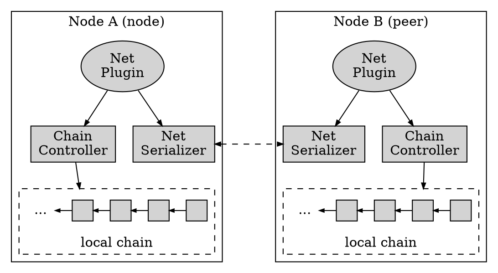
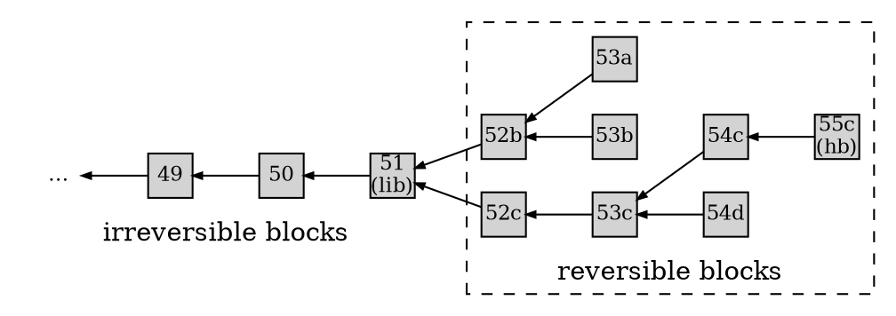
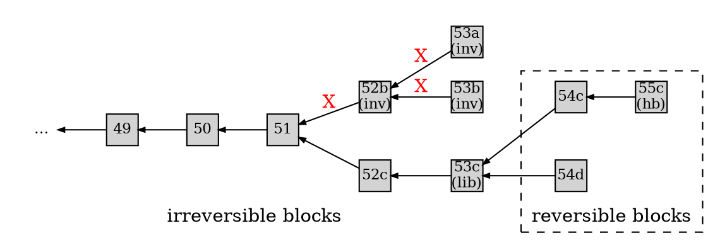
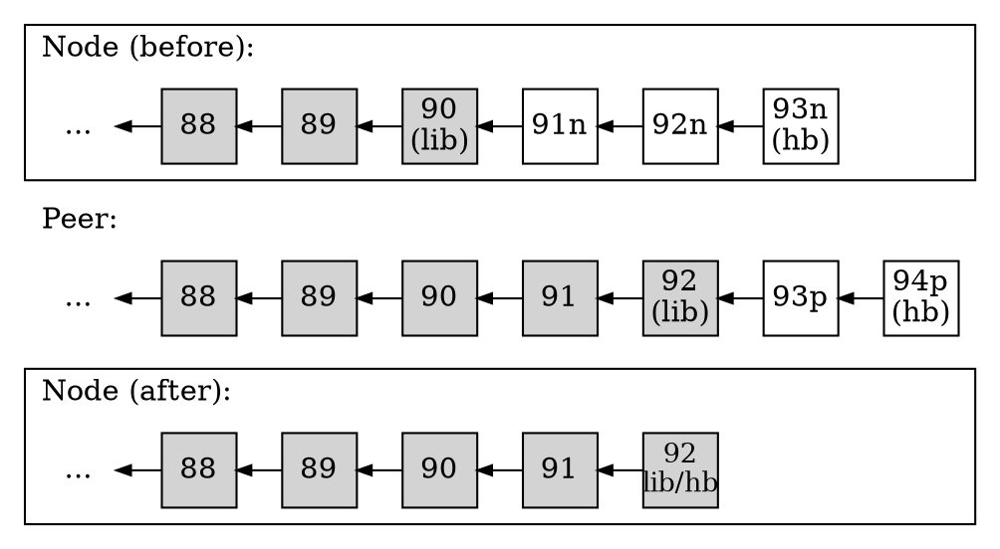
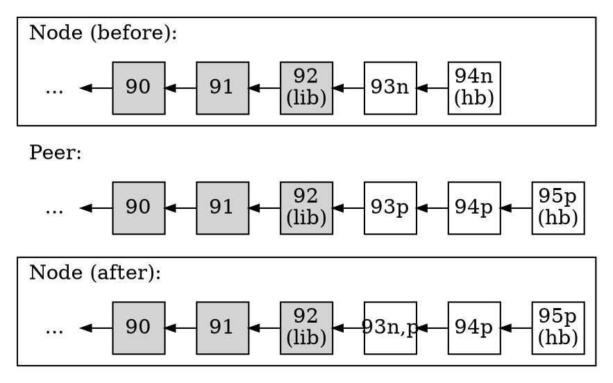

# 1. Overview

Nodes on an active EOSIO blockchain must be able to communicate with each other for relaying transactions, pushing blocks, and syncing state between peers. The peer-to-peer (p2p) protocol, part of the `nodeos` service that runs on every node, serves this purpose. The ability to sync state is crucial for each block to eventually reach finality within the global state of the blockchain and allow each node to advance the last irreversible block (LIB). In this regard, the fundamental goal of the p2p protocol is to sync blocks and propagate transactions between nodes to reach consensus and advance the blockchain state.


## 1.1. Goals

In order to add multiple transactions into a block and fit them within the specified production time of 0.5 seconds, the p2p protocol must be designed with speed and efficiency in mind. These two goals translate into maximizing transaction throughput within the effective bandwidth and reducing both network and operational latency. Some strategies to achieve this include:

*   Fit more transactions within a block for better economy of scale.
*   Minimize redundant information among blocks and transactions.
*   Allow more efficient broadcasting and syncing of node states.
*   Minimize payload footprint with data compression and binary encoding.

Most of these strategies are fully or partially implemented in the EOSIO software. Data compression, which is optional, is implemented at the transaction level. Binary encoding is implemented by the net serializer when sending object instances and protocol messages over the network.


# 2. Architecture

The main goal of the p2p protocol is to synchronize nodes securely and efficiently. To achieve this overarching goal, the system delegates functionality into four main components:

*   **Net Plugin**: defines the protocol to sync blocks and forward transactions between peers.
*   **Chain Controller**: dispatches/manages blocks and transactions received, within the node.
*   **Net Serializer**: serializes messages, blocks, and transactions for network transmission.
*   **Local Chain**: holds the node’s local copy of the blockchain, including reversible blocks.

The interaction between the above components is depicted in the diagram below:



At the highest level sits the Net Plugin, which exchanges messages between the node and its peers to sync blocks and transactions. A typical message flow goes as follows:

1. Node A sends a message to Node B through the Net Plugin (refer to diagram above).
    1. Node A’s Net Serializer packs the message and sends it to Node B.
    2. Node B’s Net Serializer unpacks the message and relays it to its Net Plugin.
2. The message is processed by Node B’s Net Plugin, dispatching the proper actions.
3. The Net Plugin accesses the local chain via the Chain Controller if necessary to push or retrieve blocks.


## 2.1. Local Chain

The local chain is the node’s local copy of the blockchain. It consists of both irreversible and reversible blocks received by the node, each block being cryptographically linked to the previous one. The list of irreversible blocks contains the actual copy of the immutable blockchain. The list of reversible blocks is typically shorter in length and it is managed by the Fork Database as the Chain Controller pushes blocks to it. The local chain is depicted below.



Each node constructs its own local copy of the blockchain as it receives blocks and transactions and syncs their state with other peers. The reversible blocks are those new blocks received that have not yet reached finality. As such, they are likely to form branches that stem from a main common ancestor, which is the LIB (last irreversible block). Other common ancestors different from the LIB are also possible for reversible blocks. In fact, any two sibling branches always have a nearest common ancestor. For instance, in the diagram above, block 52b is the nearest common ancestor for the branches starting at block 53a and 53b that is different from the LIB. Every active branch in the local chain has the potential to become part of the blockchain.

### 2.1.1. LIB Block

All irreversible blocks constructed in a node are expected to match those from other nodes up to the last irreversible block (LIB) of each node. This is the distributed nature of the blockchain. Eventually, as the blocks that follow the LIB block reach finality, the LIB block moves up the chain through one of the branches as it catches up with the head block (HB). When the LIB block advances, the immutable blockchain effectively grows. In this process, the head block might switch branches multiple times depending on the potential head block numbers received and their timestamps, which is ultimately used as tiebreaker.

## 2.2. Chain Controller

The Chain Controller manages the basic operations on blocks and transactions that change the local chain state, such as validating and executing transactions, pushing blocks, etc. The Chain Controller receives commands from the Net Plugin and dispatches the proper operation on a block or a transaction based on the network message received by the Net Plugin. The network messages are exchanged continuously between the EOSIO nodes as they communicate with each other to sync the state of blocks and transactions.

### 2.2.1. Signals' Producer and Consumer

The producer and consumer of the signals defined in the controller and their life cycle during normal operation, fork, and replay are as follows:

#### pre_accepted_block (carry signed_block_ptr)

- Produced by

| Module | Function | Condition |
| --- | --- | --- |
| controller | push_block | before the block is added to the fork db |
| | replay_push_block | before the replayed block is added to the fork db (only if the replayed block is not irreversible since irreversible block is not added to fork db during replay) |

- Consumed by

| Module | Usage |
| --- | --- |
| chain_plugin | checkpoint validation |
| | forward data to pre_accepted_block_channel |

#### accepted_block_header (carry block_state_ptr)

- Produced by

| Module | Function | Condition |
| --- | --- | --- |
| controller | push_block| after the block is added to fork db |
| | commit_block | after the block is added to fork db (only if you are the one who produce the block, in other words, this is not applicable to the block received from others) |
| | replay_push_block | after the replayed block is added to fork db | (only if the replayed block is not irreversible since irreversible block is not added to fork db during replay) |

- Consumed by

| Module | Usage |
| --- | --- |
| chain_plugin | forward data to accepted_block_header_channel |

#### accepted_block (carry block_state_ptr)

- Produced by

| Module | Function | Condition |
| --- | --- | --- |
| controller | commit_block | when the block is finalized |

- Consumed by

| Module | Usage |
| --- | --- |
| net_plugin | broadcast block to other peers |

#### irreversible_block (carry block_state_ptr)

- Produced by

| Module | Function | Condition |
| --- | --- | --- |
| controller | log_irreversible | before it's appended to the block log and before the chainbase db is committed |
| | replay_push_block | when replaying an irreversible block |

- Consumed by

| Module | Usage |
| --- | --- |
| controller | setting the current lib of wasm_interface |
| chain_plugin | forward data to irreversible_block_channel |
| mongodb_plugin | forward the data to irreversible_block_state_queue |

#### accepted_transaction (carry transaction_metadata_ptr)

- Produced by

| Module | Function | Condition |
| --- | --- | --- |
| controller | push_transaction | when the transaction executes succesfully (only once, i.e. when it's unapplied and reapplied the signal won't be emitted) |
| | push_scheduled_transaction | when the scheduled transaction executes succesfully |
| | | when the scheduled transaction fails (subjective/ soft/ hard) |
| | | when the scheduled transaction expires |
| | | after applying onerror |

- Consumed by

| Module | Usage |
| --- | --- |
| chain_plugin | forward data to accepted_transaction_channel |
| mongodb_plugin | forward the data to transaction_metadata_queue |

#### applied_transaction (carry std::tuple<const transaction_trace_ptr&, const signed_transaction&>)

- Produced by

| Module | Function | Condition |
| --- | --- | --- |
| controller | push_transaction | when the transaction executes succesfully  |
| | push_scheduled_transaction | when the scheduled transaction executes succesfully |
| | | when the scheduled transaction fails (subjective/ soft/ hard) |
| | | when the scheduled transaction expires |
| | | after applying onerror |

- Consumed by

| Module | Usage |
| --- | --- |
| chain_plugin | forward data to applied_transaction_channel |
| mongodb_plugin | forward the data to transaction_trace_queue |

#### bad_alloc
Not used.

### 2.2.2. Signals' Life Cycle

#### A. normal operation where blocks and transactions are input

1. When a transaction is pushed to the blockchain (through RPC or broadcasted by peer)
   1. Transaction is executed either succesfully/ fail the validation -> `accepted_transaction` is emitted by the controller
   2. chain_plugin will react to the signal to forward the transaction_metadata to accepted_transaction_channel
   3. mongodb_plugin will react to the signal and add the transaction_metadata to its queue to be processed later on
2. When a scheduled transaction is pushed to the blockchain
   1. Transaction is executed either succesfully/ fail subjectively/ soft fail/ hard fail -> `accepted_transaction` is emitted by the controller
   2. chain_plugin will react to the signal to forward the transaction_metadata to accepted_transaction_channel
   3. mongodb_plugin will react to the signal and add the transaction_metadata to its queue to be processed later on
3. When a block is pushed to the blockchain (through RPC or broadcasted by peer)
   1. Before the block is added to fork db -> `pre_accepted_block` will be emitted by the controller
   2. chain_plugin will react to the signal to do validation of the block forward the block_state to accepted_block_header_channel and validate it with the checkpoint
   3. After the block is added to fork db -> `accepted_block_header` will be emitted by the controller
   4. chain_plugin will react to the signal to forward the block_state to accepted_block_header_channel
   5. Then the block will be applied, at this time all the transactions and scheduled_transactions inside the block will be pushed. All signals related to push_transaction and push_scheduled_transaction (see point A.1 and A.2) will be emitted.
   6. When committing the block -> `accepted_block` will be emitted by the controller
   7. net_plugin will react to the signal and broadcast the block to the peers
   8. If a new block becomes irreversible, signals related to irreversible block will be emitted (see point A.5)
4. When a block is produced
   1. For the block that is produced by you, the block will be added to the fork_db when it is committed -> `accepted_block_header` will be emitted by the controller
   2. chain_plugin will react to the signal to forward the block_state to accepted_block_header_channel and validate it with the checkpoint
   3. Immediately after that (during commiting the block) -> `accepted_block` will be emitted by the controller
   4. net_plugin will react to the signal and broadcast the block to the peers
   5. If a new block becomes irreversible, signals related to irreversible block will be emitted (see point A.5)
5. When a block becomes irreversible
   1. Once a block is deemed irreversible -> `irreversible_block` will be emitted by the controller before the block is appended to the block log and the chainbase db is committed
   2. chain_plugin will react to the signal to forward the block_state to irreversible_block_channel and also set the lib of wasm_interface
   3. mongodb_plugin will react to the signal and add the transaction_metadata to its queue to be processed later on

#### B. operation where forks are presented and resolved

1. When forks are presented, the blockchain will pop all existing blocks up to the forking point and then apply all new blocks in the fork.
2. When applying the new block, all the transactions and scheduled_transactions inside the block will be pushed. All signals related to push_transaction and push_scheduled_transaction (see point A.1 and A.2) will be emitted.
3. And then when committing the new block -> `accepted_block` will be emitted by the controller
4. net_plugin will react to the signal and broadcast the block to the peers
5. If If a new block becomes irreversible, signals related to irreversible block will be emitted (see point A.5)

#### C. normal replay (with or without replay optimization)

1. When replaying irreversible block -> `irreversible_block` will be emitted by the controller
2. Refer to A.5 to see how `irreversible_block` signal is responded
3. When replaying reversible block, before the block is added to fork_db -> `pre_accepted_block` will be emitted by the controller
4. When replaying reversible block, after the block is added to fork db -> `accepted_block_header` will be emitted by the controller
5. When replaying reversible block, when the block is committed -> `accepted_block` will be emitted by the controller
6. Refer to A.3 to see how `pre_accepted_block`, `accepted_block_header` and `accepted_block` signal are responded

### 2.2.3. Fork Database

The Fork Database (Fork DB) provides an internal interface for the Chain Controller to perform operations on the node’s local chain. As new blocks are received from other peers, the Chain Controller pushes these blocks to the Fork DB. Each block is then cryptographically linked to a previous block. Since there might be more than one previous block, the process is likely to produce temporary branches called mini-forks. Thus, the Fork DB serves three main purposes:

*   Resolve which branch the pushed block (new head block) will build off from.
*   Advance the head block, the root block, and the LIB block.
*   Trim off invalid branches and purge orphaned blocks.

In essence, the Fork DB contains all the candidate block branches within a node that may become the actual branch that continues to grow the blockchain. The root block always marks the beginning of the reversible block tree, and will match the LIB block, except when the LIB advances, in which case the root block must catch up. The calculation of the LIB block as it advances through the new blocks within the Fork DB will ultimately decide which branch gets selected. As the LIB block advances, the root block catches up with the new LIB, and any candidate branch whose ancestor node is behind the LIB gets pruned. This is depicted below.



In the diagram above, the branch starting at block 52b gets pruned (blocks 52b, 53a, 53b are invalid) after the LIB advances from node 51 to block 52c then 53c. As the LIB moves through the reversible blocks, they are moved from the Fork DB to the local chain as they now become part of the immutable blockchain. Finally, block 54d is kept in the Fork DB since new blocks might still be built off from it.


## 2.3. Net Plugin

The Net Plugin defines the actual peer to peer communication messages between the EOSIO nodes. The main goal of the Net Plugin is to sync valid blocks upon request and to forward valid transactions invariably. To that end, the Net Plugin delegates functionality to the following components:

*   **Sync Manager**: maintains the block syncing state of the node with respect to its peers.
*   **Dispatch Manager**: maintains the list of blocks and transactions sent by the node.
*   **Connection List**: list of active peers the node is currently connected to. 
*   **Message Handler**: dispatches protocol messages to the corresponding handler. (see [4.2. Protocol Messages](#42-protocol-messages)).


### 2.3.1. Sync Manager

The Sync Manager implements the functionality for syncing block state between the node and its peers. It processes the messages sent by each peer and performs the actual syncing of the blocks based on the status of the node’s LIB or head block with respect to that peer. At any point, the node can be in any of the following sync states:

*   **LIB Catch-Up**: node is about to sync with another peer's LIB block.
*   **Head Catch-Up**: node is about to sync with another peer's HEAD block.
*   **In-Sync**: both LIB and HEAD blocks are in sync with the other peers.

If the node’s LIB or head block is behind, the node will generate sync request messages to retrieve the missing blocks from the connected peer. Similarly, if a connected peer’s LIB or head block is behind, the node will send notice messages to notify the node about which blocks it needs to sync with. For more information about sync modes see [3. Operation Modes](#3-operation-modes).


### 2.3.2. Dispatch Manager

The Dispatch Manager maintains the state of blocks and loose transactions received by the node. The state contains basic information to identify a block or a transaction and it is maintained within two indexed lists of block states and transaction states:

*   **Block State List**: list of block states managed by node for all blocks received.
*   **Transaction State List**: list of transaction states managed by node for all transactions received.

This makes it possible to locate very quickly which peer has a given block or transaction.


#### 2.3.2.1. Block State

The block state identifies a block and the peer it came from. It is transient in nature, so it is only valid while the node is active. The block state contains the following fields:

Block State Fields | Description
-|-
`id` | 256-bit block identifier. A function of the block contents and the block number.
`block_num` | 32-bit unsigned counter value that identifies the block sequentially since genesis.
`connection_id` | 32-bit unsigned integer that identifies the connected peer the block came from.
`have_block` | boolean value indicating whether the actual block has been received by the node.

The list of block states is indexed by block ID, block number, and connection ID for faster lookup. This allows to query the list for any blocks given one or more of the indexed attributes.


#### 2.3.2.2. Transaction State

The transaction state identifies a loose transaction and the peer it came from. It is also transient in nature, so it is only valid while the node is active. The transaction state contains the following fields:

Transaction State Fields | Description
-|-
`id` | 256-bit hash of the transaction instance, used as transaction identifier.
`expires` | expiration time since EOSIO block timestamp epoch (January 1, 2000).
`block_num` | current head block number. Transaction drops when LIB catches up to it.
`connection_id` | 32-bit integer that identifies the connected peer the transaction came from.

The `block_num` stores the node's head block number when the transaction is received. It is used as a backup mechanism to drop the transaction when the LIB block number catches up with the head block number, regardless of expiration.

The list of transaction states is indexed by transaction ID, expiration time, block number, and connection ID for faster lookup. This allows to query the list for any transactions given one or more of the indexed attributes.


#### 2.3.2.3. State Recycling

As the LIB block advances (see [3.3.1. LIB Catch-Up Mode](#331-lib-catch-up-mode)), all blocks prior to the new LIB block are considered finalized, so their state is removed from the local list of block states, including the list of block states owned by each peer in the list of connections maintained by the node. Likewise, transaction states are removed from the list of transactions based on expiration time. Therefore, after a transaction expires, its state is removed from all lists of transaction states.

The lists of block states and transaction states have a light footprint and feature high rotation, so they are maintained in memory for faster access. The actual contents of the blocks and transactions received by a node are stored temporarily in the fork database and the various incoming queues for applied and unapplied transactions, respectively.


### 2.3.3. Connection List

The Connection List contains the connection state of each peer. It keeps information about the p2p protocol version, the state of the blocks and transactions from the peer that the node knows about, whether it is currently syncing with that peer, the last handshake message sent and received, whether the peer has requested information from the node, the socket state, the node ID, etc. The connection state includes the following relevant fields:

*   **Info requested**: whether the peer has requested information from the node.
*   **Socket state**: a pointer to the socket structure holding the TCP connection state.
*   **Node ID**: the actual node ID that distinguishes the peer’s node from the other peers.
*   **Last Handshake Received**: last handshake message instance received from the peer.
*   **Last Handshake Sent**: the last handshake message instance sent to the peer.
*   **Handshake Sent Count**: the number of handshake messages sent to the peer.
*   **Syncing**: whether or not the node is syncing with the peer.
*   **Protocol Version**: the internal protocol version implemented by the peer’s Net Plugin.

The block state consists of the following fields:

*   **Block ID**: a hash of the serialized contents of the block.
*   **Block number**: the actual block number since genesis.

The transaction state consists of the following fields:

*   **Transaction ID**: a hash of the serialized contents of the transaction.
*   **Block number**: the actual block number the transaction was included in.
*   **Expiration time**: the time in seconds for the transaction to expire.


## 2.4. Net Serializer

The Net Serializer has two main roles:

*   Serialize objects and messages that need to be transmitted over the network.
*   Serialize objects and messages that need to be cryptographically hashed.

In the first case, each serialized object or message needs to get deserialized at the other end upon receipt from the network for further processing. In the latter case, serialization of specific fields within an object instance is needed to generate cryptographic hashes of its contents. Most IDs generated for a given object type (action, transaction, block, etc.) consist of a cryptographic hash of the relevant fields from the object instance. 


# 3. Operation Modes

From an operational standpoint, a node can be in either one of three states with respect to a connected peer:

*   **In-Sync mode**: node is in sync with peer, so no blocks are required from that peer.
*   **LIB Catch-Up mode**: node requires blocks since LIB block is behind that peer’s LIB.
*   **HEAD Catch-Up mode**: node requires blocks since HEAD block is behind that peer’s Head.

The operation mode for each node is stored in a sync manager context within the Net Plugin of the nodeos service. Therefore, a node is always in either in-sync mode or some variant of catchup mode with respect to its connected peers. This allows the node to switch back and forth between catchup mode and in-sync mode as the LIB and head blocks are updated and new fresh blocks are received from other peers.


## 3.1. Block ID

The EOSIO software checks whether two blocks match or hold the same content by comparing their block IDs. A block ID is a function that depends on the contents of the block header and the block number (see [Consensus Protocol: 5.1. Block Structure](10_consensus_protocol.md#51-block-structure)). Checking whether two blocks are equal is crucial for syncing a node’s local chain with that of its peers. To generate the block ID from the block contents, the block header is serialized and a SHA-256 digest is created. The most significant 32 bits are assigned the block number while the least significant 224 bits of the hash are retained. Note that the block header includes the root hash of both the transaction merkle tree and the action merkle tree. Therefore, the block ID depends on all transactions included in the block as well as all actions included in each transaction.


## 3.2. In-Sync Mode

During in-sync mode, the node's head block is caught up with the peer's head block, which means the node is in sync block-wise. When the node is in-sync mode, it does not request further blocks from peers, but continues to perform the other functions:

*   **Validate transactions**, drop them if invalid; forward them to other peers if valid.
*   **Validate blocks**, drop them if invalid; forward them to other peers upon request if valid.

Therefore, this mode trades bandwidth in favor of latency, being particularly useful for validating transactions that rely on TaPoS (transaction as proof of stake) due to lower processing overhead.

Note that loose transactions are always forwarded if valid and not expired. Blocks, on the other hand, are only forwarded if valid and if explicitly requested by a peer. This reduces network overhead.


## 3.3. Catch-Up Mode

A node is in catchup mode when its head block is behind the peer’s LIB or the peer’s head block. If syncing is needed, it is performed in two sequential steps:

1. Sync the node’s LIB from the nearest common ancestor + 1 up to the peer’s LIB.
2. Sync the node’s head from the nearest common ancestor + 1 up to the peer’s head.

Therefore, the node’s LIB block is updated first, followed by the node’s head block. 


### 3.3.1. LIB Catch-Up Mode

Case 1 above, where the node’s LIB block needs to catch up with the peer’s LIB block, is depicted in the below diagram, before and after the sync (Note: inapplicable branches have been removed for clarity):



In the above diagram, the node’s local chain syncs up with the peer’s local chain by appending finalized blocks 91 and 92 (the peer’s LIB) to the node’s LIB (block 90). Note that this discards the temporary fork consisting of blocks 91n, 92n, 93n. Also note that these nodes have an “n” suffix (short for node) to indicate that they are not finalized, and therefore, might be different from the peer’s. The same applies to unfinalized blocks on the peer; they end in “p” (short for peer). After syncing, note that both the LIB (lib) and the head block (hb) have the same block number on the node.


### 3.3.2. Head Catch-Up Mode

After the node’s LIB block is synced with the peer’s, there will be new blocks pushed to either chain. Case 2 above covers the case where the peer’s chain is longer than the node’s chain. This is depicted in the following diagram, which shows the node and the peer’s local chains before and after the sync:



In either case 1 or 2 above, the syncing process in the node involves locating the first common ancestor block starting from the node’s head block, traversing the chains back, and ending in the LIB blocks, which are now in sync (see [3.3.1. LIB Catch-Up Mode](#331-lib-catch-up-mode)). In the worst case scenario, the synced LIBs are the nearest common ancestor. In the above diagram, the node’s chain is traversed from head block 94n, 93n, etc. trying to match blocks 94p, 93p, etc. in the peer’s chain. The first block that matches is the nearest common ancestor (block 93n and 93p in the diagram). Therefore, the following blocks 94p and 95p are retrieved and appended to the node’s chain right after the nearest common ancestor, now re-labeled 93n,p (see [3.3.3. Block Retrieval](#333-block-retrieval) process). Finally, block 95p becomes the node’s head block and, since the node is fully synced with the peer, the node switches to in-sync mode.


### 3.3.3. Block Retrieval

After the common ancestor is found, a sync request message is sent to retrieve the blocks needed by the node, starting from the next block after the nearest common ancestor and ending in the peer’s head block.

To make effective use of bandwidth, the required blocks are obtained from various peers, rather than just one, if necessary.  Depending on the number of blocks needed, the blocks are requested in chunks by specifying the start block number and the end block number to download from a given peer. The node uses the list of block states to keep track of which blocks each peer has, so this information is used to determine which connected peers to request block chunks from. This process is depicted in the diagram below:


When both LIB and head blocks are caught up with respect to the peer, the operation mode in the Sync Manager is switched from catch-up mode to in-sync mode.


## 3.4. Mode Switching

Eventually, both the node and its peer receive new fresh blocks from other peers, which in turn push the blocks to their respective local chains. This causes the head blocks on each chain to advance. Depending on which chain grows first, one of the following actions occur:

*   The node sends a catch up request message to the peer with its head block info.
*   The node sends a catch up notice message to inform the peer it needs to sync.

In the first case, the node switches the mode from in-sync to head catchup mode. In the second case, the peer switches to head catchup mode after receiving the notice message from the node. In practice, in-sync mode is short-lived. In a busy EOSIO blockchain, nodes spend most of their time in catchup mode validating transactions and syncing their chains after catchup messages are received.


# 4. Protocol Algorithm

The p2p protocol algorithm runs on every node, forwarding validated transactions and validated blocks. Starting EOSIO v2.0, a node also forwards block IDs of unvalidated blocks it has received. In general, the simplified process is as follows:

1. A node requests data or sends a control message to a peer.
2. If the request can be fulfilled, the peer executes the request; repeat 1. 

The data messages contain the block contents or the transaction contents. The control messages make possible the syncing of blocks and transactions between the node and its peers (see [Protocol Messages](#42-protocol-messages)). In order to allow such synchronization, each node must be able to retrieve information about its own state of blocks and transactions as well as that of its peers.


## 4.1. Node/Peers Status

Before attempting to sync state, each node needs to know the current status of its own blocks and transactions. It must also be able to query other peers to obtain the same information. In particular, nodes must be able to obtain the following on demand:

*   Each node can find out which blocks and transactions it currently has.
*   All nodes can find out which blocks and transactions their peers have.
*   Each node can find out which blocks and transactions it has requested.
*   All nodes can find out when each node has received a given transaction.

To perform these queries, and thereafter when syncing state, the Net Plugin defines specific communication messages to be exchanged between the nodes. These messages are sent by the Net Plugin when transmitted and received over a TCP connection.


## 4.2. Protocol Messages

The p2p protocol defines the following control messages for peer to peer node communication:

Control Message | Description
-|-
`handshake_message` | initiates a connection to another peer and sends LIB/head status.
`chain_size_message` | requests LIB/head status from peer. Not currently implemented.
`go_away_message` | sends disconnection notification to a connecting or connected peer.
`time_message` | transmits timestamps for peer synchronization and error detection.
`notice_message` | informs peer which blocks and transactions node currently has.
`request_message` | informs peer which blocks and transaction node currently needs.
`sync_request_message` | requests peer a range of blocks given their start/end block numbers.

The protocol also defines the following data messages for exchanging the actual contents of a block or a loose transaction between peers on the p2p network:

Data Message | Description
-|-
`signed_block_v0` | serialized contents of a signed block v0 (no pruned CFD support).
`packed_transaction_v0` | serialized contents of a packed transaction v0 (no pruned CFD).
`signed_block` | serialized contents of a signed block v1 (with pruned context-free data support).
`trx_message_v1` | serialized contents of transaction ID and packed transaction v1 (supports pruned CFD).


### 4.2.1. Handshake Message

The handshake message is sent by a node when connecting to another peer. It is used by the connecting node to pass its chain state (LIB number/ID and head block number/ID) to the peer. It is also used by the peer to perform basic validation on the node the first time it connects, such as whether it belongs to the same blockchain, validating that fields are within range, detecting inconsistent block states on the node, such as whether its LIB is ahead of the head block, etc. The handshake message consists of the following fields:

Message Field | Description
-|-
`network_version` | internal net plugin version to keep track of protocol updates.
`chain_id` | hash value of the genesis state and config options. Used to identify chain.
`node_id` | the actual node ID that distinguishes the peer’s node from the other peers.
`key` | public key for peer to validate node; may be a producer or peer key, or empty.
`time` | timestamp the handshake message was created since epoch (Jan 1, 2000).
`token` | SHA-256 digest of timestamp to prove node owns private key of the key above.
`sig` | signature for the digest above after node signs it with private key of the key above.
`p2p_address` | IP address of node.
`last_irreversible_block_num` | the actual block count of the LIB block since genesis.
`last_irreversible_block_id` | a hash of the serialized contents of the LIB block.
`head_num` | the actual block count of the head block since genesis.
`head_id` | a hash of the serialized contents of the head block.
`os` | operating system where node runs. This is detected automatically.
`agent` | the name supplied by node to identify itself among its peers.
`generation` | counts `handshake_message` invocations; detects first call for validation.

If all checks succeed, the peer proceeds to authenticate the connecting node based on the `--allowed-connection` setting specified for that peer's net plugin when `nodeos` started:

*   **Any**: connections are allowed without authentication.
*   **Producers**: peer key is obtained via p2p protocol.
*   **Specified**: peer key is provided via settings.
*   **None**: the node does not allow connection requests.

The peer key corresponds to the public key of the node attempting to connect to the peer. If authentication succeeds, the receiving node acknowledges the connecting node by sending a handshake message back, which the connecting node validates in the same way as above. Finally, the receiving node checks whether the peer’s head block or its own needs syncing. This is done by checking the state of the head block and the LIB of the connecting node with respect to its own. From these checks, the receiving node determines which chain needs syncing.


### 4.2.2. Chain Size Message

The chain size message was defined for future use, but it is currently not implemented. The idea was to send ad-hoc status notifications of the node’s chain state after a successful connection to another peer. The chain size message consists of the following fields:

Message Field | Description
-|-
`last_irreversible_block_num` | the actual block count of the LIB block since genesis.
`last_irreversible_block_id` | a hash of the serialized contents of the LIB block.
`head_num` | the actual block count of the head block since genesis.
`head_id` | a hash of the serialized contents of the head block.

The chain size message is superseded by the handshake message, which also sends the status of the LIB and head blocks, but includes additional information so it is preferred.


### 4.2.3. Go Away Message

The go away message is sent to a peer before closing the connection. It is usually the result of an error that prevents the node from continuing the p2p protocol further. The go away message consists of the following fields:

Message Field | Description
-|-
`reason` | an error code signifying the reason to disconnect from peer.
`node_id` | the node ID for the disconnecting node; used for duplicate notification.

The current reason codes are defined as follows:

*   **No reason**: indicate no error actually; the default value.
*   **Self**: node was attempting to self connect.
*   **Duplicate**: redundant connection detected from peer.
*   **Wrong chain**: the peer's chain ID does not match.
*   **Wrong version**: the peer's network version does not match.
*   **Forked**: the peer's irreversible blocks are different
*   **Unlinkable**: the peer sent a block we couldn't use
*   **Bad transaction**: the peer sent a transaction that failed verification.
*   **Validation**: the peer sent a block that failed validation.
*   **Benign other**: reasons such as a timeout. not fatal but warrant resetting.
*   **Fatal other**: a catch all for fatal errors that have not been isolated yet.
*   **Authentication**: peer failed authentication.

After the peer receives the go away message, the peer should also close the connection.


### 4.2.4. Time Message

The time message is used to synchronize events among peers, measure time intervals, and detect network anomalies such as duplicate messages, invalid timestamps, broken nodes, etc. The time message consists of the following fields:

Message Field | Description
-|-
`org` | origin timestamp; set when marking the beginning of a time interval.
`rec` | receive timestamp; set when a message arrives from the network.
`xmt` | transmit timestamp; set when a message is placed on the send queue.
`dst` | destination timestamp; set when marking the end of a time interval.


### 4.2.5. Notice Message

The notice message is sent to notify a peer which blocks and loose transactions the node currently has. The notice message consists of the following fields :

Message Field | Description
-|-
`known_trx` | sorted list of known transaction IDs node has available.
`known_blocks` | sorted list of known block IDs node has available.

Notice messages are lightweight since they only contain block IDs and transaction IDs, not the actual block or transaction.


### 4.2.6. Request Message

The request message is sent to notify a peer which blocks and loose transactions the node currently needs. The request message consists of the following fields:

Message Field | Description
-|-
`req_trx` | sorted list of requested transaction IDs required by node.
`req_blocks` | sorted list of requested block IDs required by node.


### 4.2.7. Sync Request Message

The sync request message requests a range of blocks from peer. The sync request message consists of the following fields:

Message Field | Description
-|-
`start_block` | start block number for the range of blocks to receive from peer.
`end_block` | end block number for the range of blocks to receive from peer.

Upon receipt of the sync request message, the peer sends back the actual blocks for the range of block numbers specified.


## 4.3. Message Handler

The p2p protocol uses an event-driven model to process messages, so no polling or looping is involved when a message is received. Internally, each message is placed in a queue and the next message in line is dispatched to the corresponding message handler for processing. At a high level, the message handler can be defined as follows:

```console
   receiver/read handler:
      if handshake message:
         verify that peer's network protocol is valid
         if node's LIB < peer's LIB:
            sync LIB with peer's; continue
         if node's LIB > peer's LIB:
            send LIB catchup notice message; continue
      if notice message:
         update list of blocks/transactions known by remote peer
      if trx message:
         insert into global state as unvalidated
         validate transaction; drop if invalid, forward if valid
      else
         close the connection
```


## 4.4. Send Queue

Protocol messages are placed in a buffer queue and sent to the appropriate connected peer. At a higher level, a node performs the following operations with each connected peer in a round-robin fashion:

```console
   send/write loop:
      if peer knows the LIB:
         if peer does not know we have a block or transaction:
            next iteration
         if peer does not know about a block:
            send transactions for block that peer does not know
            next iteration 
         if peer does not know about transactions:
            sends oldest transactions unknown to remote peer
            next iteration
         wait for new validated block, transaction, or peer signal
      else:
         assume peer is in catchup mode (operating on request/response)
         wait for notice of sync from the read loop
```


# 5. Protocol Improvements

Any software updates to the p2p protocol must also scale progressively and consistently across all nodes. This translates into installing updates that reduce operation downtime and potentially minimize it altogether while deploying new functionality in a backward compatible manner, if possible. On the other hand, data throughput can be increased by taking measures that minimize message footprint, such as using data compression and binary encoding of the protocol messages.
