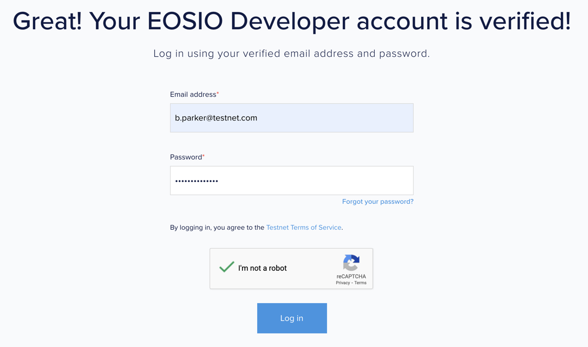
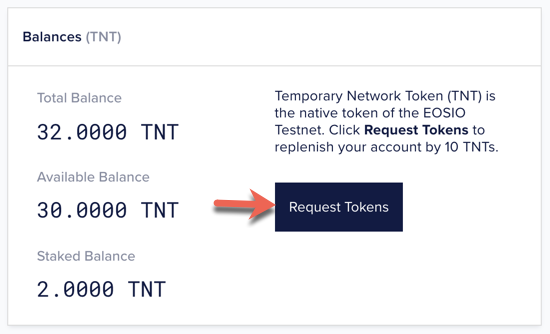
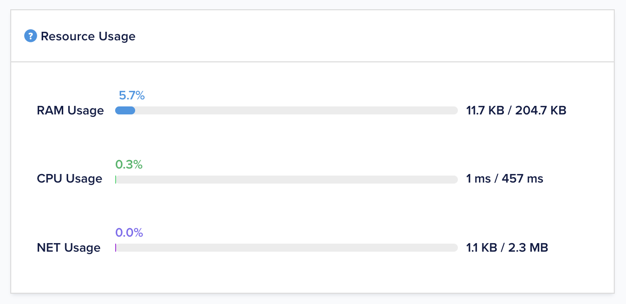
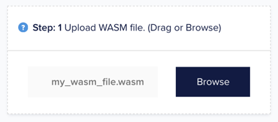
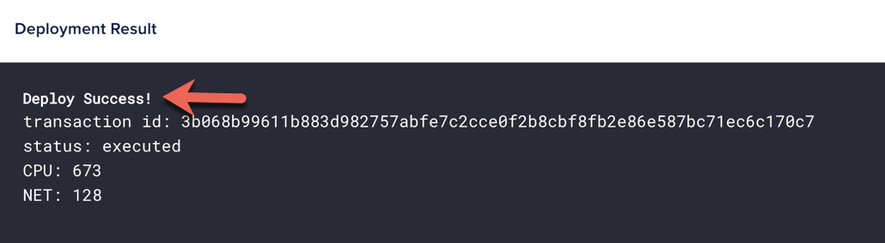
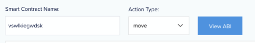
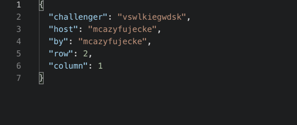
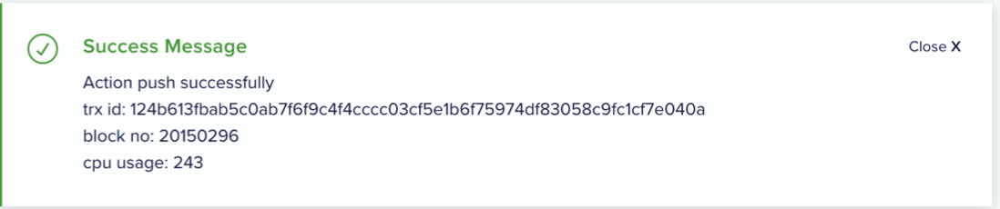
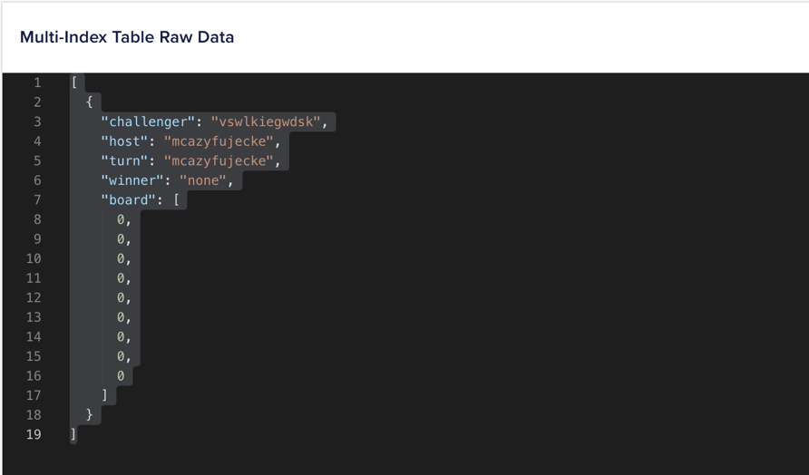
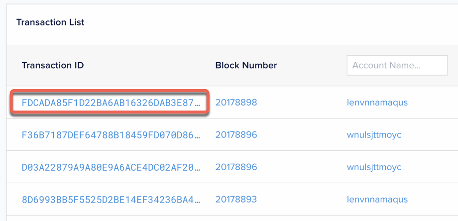

# **Overview**

This guide is for users who intend to use the EOSIO Testnet as a testing environment for deploying smart contracts and building blockchain applications on EOSIO. The EOSIO Testnet allows developers to quickly onboard by creating new blockchain accounts and test smart contracts on the latest builds of the EOSIO software. You can deploy smart contracts, push transactions, and view the multi-index table in a user-friendly GUI.

The EOSIO Testnet is a web application that you can access using your login credentials. You don't have to download binaries to install the system as no external installation or configuration is required.

[[info]]
| This guide also supports EOSIO-based documentation tutorials that use the Testnet to perform various smart contract operations including pushing permission-based actions.

# Getting Started with Testnet
This chapter provides instructions for registering a new EOSIO Testnet developer account and steps to log in to the Testnet web interface.

When you register on the EOSIO Testnet, we will create a new developer account for you - a login credential for you to log in to the Testnet. With the new developer account, a new blockchain account is also provisioned to interact with the blockchain by deploying smart contracts, pushing actions, reading blockchain data, and other related operations.

[[info | Note]]
| The developer account is only used for login purposes and should not be confused with a blockchain account.

## Testnet Sign Up
This section outlines the steps for creating a new Testnet developer account.

Complete the following steps to create a Testnet developer account:

1. Visit the [signup page](https://testnet.eos.io/user#signup) on the Testnet website and enter the requested details.

   
2. Read the terms and conditions and click the checkboxes if you agree.

   
3. Click the checkbox in the **I’m not a robot** captcha clicker and then click **Register**.

   
4. Visit your inbox to verify your email address.

    
5. Click **VERIFY ACCOUNT** in the verification email.

    
6. Once your email address is verified, enter your login details and click **Log in**.

     

After you click **Log In**, the welcome page invites you to a getting started tour. Complete the getting started tour, or optionally, click **Skip tour** at the bottom.
      

## Testnet Login
If you already have a Developer Testnet account, log in at [EOSIO Testnet Login](https://testnet.eos.io/user#login).

# Blockchain Account Configuration
This section provides instructions on creating new blockchain accounts within the Testnet and additional administrative actions such as requesting new Temporary Network Tokens (TNTs) for staking and unstaking system resources.

An account is a collection of authorizations, is stored on the blockchain, and is used to identify a sender/recipient. The flexible authorization structure of an account enables it to be owned either by an individual or group of individuals dependant on how permissions are configured. An account sends or receives a valid transaction to the blockchain.

For more information on EOSIO accounts and associated permissions, see the [Accounts and Permissions](../../../60_protocol-guides/40_accounts_and_permissions.md) page on the _EOSIO Developers Portal_.

## Create New Account
The EOSIO Testnet provisions a new EOSIO blockchain account every time you sign up for a new EOSIO Testnet developer account. If you require more EOSIO blockchain accounts, follow the steps below.

**Complete the following steps to create a new account:**

1. Log in to [EOSIO Testnet](https://testnet.eos.io/user#login) and navigate to **Blockchain Accounts** from the top navigation menu.

     
2. To create a new account, click **create another account** next to the existing account name as shown below.

      

[[info | Note]]
| You can see your existing blockchain accounts in the drop-down menu.

**Result**: The previous action creates a new blockchain account as show below:

   

After creating new accounts, request Temporary Network Tokens (TNTs) as outlined in the next section **Request Tokens**.

## Request Tokens
Temporary Network Tokens (TNTs) are the native tokens of the EOSIO Testnet. By default, each account contains 32 TNTs. Tokens allow you to get more system resources on Testnet to deploy contracts, interact with smart contracts, and store data on the blockchain.

**To request new TNTs**, In the **Balances (TNT)** block, click the **Request Tokens** button to replenish your account by 10 tokens.

 

**Result**: This action replenishes your account by 10 tokens and disables the **Request Tokens** button for the next 60 minutes as show below:

   

[[info | Note]]
| TNTs are replenished every hour by the system. After requesting the first set of tokens, wait for 60 minutes before requesting another round of tokens.

## Buy and Stake Resources

For more information on staking, see the [Staking on EOSIO Based Blockchains](https://developers.eos.io/manuals/eosio.contracts/latest/key-concepts/stake) section on the *EOSIO Developers Portal*.

Complete the following steps to buy and stake system resources:

1. On the **Blockchain Accounts** page, scroll down to **Request Resources**.
2. To buy **RAM**, enter the amount in bytes and click on the **Get RAM** button.

   
3. To stake **CPU**, enter the TNT amount and click the **Stake** button.

   
4. To stake **NET**, enter the TNT amount and click the **Stake** button.

   

To learn more about ***EOSIO system resources***, see the following documentation on the *EOSIO Developers Portal*:

* [RAM as Resource](https://developers.eos.io/manuals/eosio.contracts/latest/key-concepts/ram)
* [CPU as Resource](https://developers.eos.io/manuals/eosio.contracts/latest/key-concepts/cpu)
* [NET as Resource](https://developers.eos.io/manuals/eosio.contracts/latest/key-concepts/net)

## View Account Details
Once your new blockchain account is created, you can view the following account details in the Testnet:

* **TNT Balances**: This detail displays the Temporary Network Token (TNT) total balance, available balance, and the staked balance for the specific account. Use tokens to purchase system resources.

   
* **Resource Usage**: This detail displays the percentage utilization of system resources and the amount of resources available.

   
* **Keys**: This detail displays automatically generated public and private keys pairs.

   
* **Transaction list**: The number of transactions performed on behalf of the account.

   

**Complete the following steps to view account details:**

1. Log in to [EOSIO Testnet](https://testnet.eos.io/user#login) and navigate to **Blockchain Accounts** from the top navigation menu.

   
2. From the drop-down menu, select the blockchain account.

   
3. Click on the account name.

    

**Result**: This action displays the account details.

   

# Smart Contract Deployment

This chapter provides instructions on how to upload and deploy a compiled smart contract using the Testnet GUI.

## Prerequisites
You must have the following prerequisites before uploading and deploying a smart contract:

1. EOSIO CDT-compiled smart contract files. 
    1. The WASM file
    2. The ABI file
1. Testnet blockchain account with sufficient system resources. See the previous section of this guide **Buy and Stake System Resources** for information on staking and unstaking in the Testnet.

[[info | Info]]
| For more information on how to build and compile smart contract source files, see the [Hello World Contract](../../../40_smart-contract-guides/10_hello-world.md) section on the *EOSIO Developers Portal*. 

## Upload and Deploy
Upload and deploy your smart contract on the EOSIO blockchain in a 3-step sequential process.

**Complete the following steps to upload and deploy your smart contract:**

1. Click the **Browse** button to select the compiled WASM file.

   
2. Click the **Browse** button to select the generated ABI file.

    
3. From the drop-down menu, select the blockchain account with sufficient system resources and click the **Deploy** button.

   

**Result**: The smart contract successfully deploys to the selected account.

   

[[info | Info]]
| If you encounter an unsuccessful deploy error message, make sure you have sufficient RAM on your account and try again.

# Push Actions
An action is authorized by one or more actors created on the blockchain. Actions are created explicitly within a smart contract, or generated implicitly by application code.

For more information on Actions in EOSIO, see the [Actions](../../../60_protocol-guides/20_transactions_protocol.md#11-Actions) section in Transaction Protocol on the *EOSIO Developers Portal*.

**Complete the following steps to push actions on the Testnet:**

1. Navigate to the **Push Action** page from the top navigation menu.

   
2. Enter the account name where the smart contract is deployed and select the action type in the **Action Type** drop-down menu.

   
3. Enter the JSON payload containing the action data according to the parameters from the corresponding smart contract action as shown in the example below.

   
4. Select the relevant permission associated with the account and click **Push**.

   

**Result**

# View Actions Data
View the push actions data that is populated in the multi-Index table.

**Complete the following steps to view multi-index table data:**

1. Log in to [EOSIO Testnet](https://testnet.eos.io/user#login) and navigate to **Blockchain Accounts** from the top navigation menu.

   
2. Select the blockchain account that has a smart contract deployed from the drop-down.

   
3. Click on the **Account Name**.

   
4. In the account details page, click **Smart Contract**.

   
5. Scroll down to the **Multi-Index Tables** section and select:
   1. The multi-index table from the drop-down.
         
   2. The name of your blockchain account in **Scope Name**.

         
   3. The number of indexes in **Index**.
The type of key in **Key Type**.
6. Click **Get data**.

      

**Result**: The right hand interface displays the Multi-Index raw data related to your actions.

   

# View Transactions
A transaction instance contains a transaction header and the list of action instances and transaction extensions that make the actual transaction.

For more information on Transactions in EOSIO, see the [Transactions Protocol](../../../60_protocol-guides/20_transactions_protocol.md) section on the *EOSIO Developers Portal*.

**Complete the following steps to view transactions on the Testnet:**

1. Navigate to the **Transactions** page form the top navigation menu.

   
2. From the **Transactions list**, click on a transaction.

    
3. View the transaction details containing associated metadata including the list of actions within the transaction.

    

    
