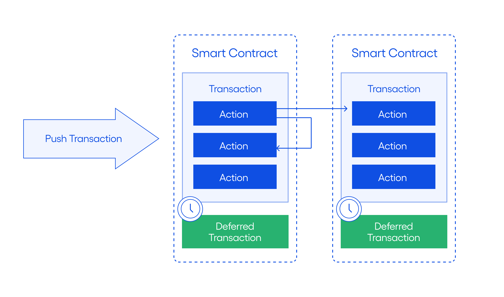

# Tic-tac-toe on EOSIO 
This tic-tac-toe tutorial guides you step by step to build a tic-tac-toe game which runs on an EOSIO blockchain. You will create a smart contract containing the game logic, then compile and deploy this smart contract to an EOSIO blockchain. In this tutorial we use the EOSIO Testnet blockchain and show you how to play the game by calling the smart contract.

[[info]]
| EOSIO is a blockchain software platform developed by Block.one. Smart contracts which run on the EOSIO platform should run on any blockchain which using the EOSIO platform. EOS is a digital token, though it also refers to the first public blockchain run on the EOSIO platform, EOS or the public mainnet. In this tutorial we will use the Block.one testnet, which is a blockchain operated by Block.one for testing.


We explain the purpose of each step and why it is important.

## Prerequisites
This tutorial requires the following:

* Knowledge of the C++ programming language.
* A code editor or an IDE. 

and

* An EOSIO Testnet account, click on the following link for the [EOSIO Testnet quick start guide](../70_quick-start-guides/10_testnet-quick-start-guide) 
* Familiarity with the EOSIO tools `cleos` and `keosd`.
* The EOSIO Contract Development Toolkit or eosio.cdt. See the [Getting Started Guide](../30_getting-started-guide) for details on how to install and set up the required EOSIO components.
* Familiarity with the `eosio.cdt` which is used to compile smart contracts. 

Click on this link for an [overview of the EOSIO platform.](../20_introduction-to-eosio)

Click on this link to [get started with EOSIO.](../30_getting-started-guide "Getting Started with EOSIO")
   
### Tutorial Workflow

```sequence
Understand\n Game->Understand\n EOSIO : What?
Understand\n EOSIO->Create\nAccounts  : Accounts
Understand\n EOSIO->Create\nAccounts  : Actions
Understand\n EOSIO->Create\nAccounts  : Resources
Create\nAccounts->Create\nSmart Contract : How?
Create\nSmart Contract -> Compile\nDeploy : Code
Compile\nDeploy -> Play\nGame : Load
Play\nGame -> Play\nGame : Push
Play\nGame -> Play\nGame : Get
```


## The Rules of the Game
The EOSIO tic-tac-toe rules are:

* Player one (the host) makes the first move, followed by player two (the challenger). 
* The first player to complete a row or diagonal of either X’s or O’s wins the game.
* If no player completes a row or diagonal of either X’s or O’s, the game is a draw. 

## Understanding the Game
The smart contract contains the game logic, therefore this section introduces how the game works and some of the EOSIO concepts needed to build a smart contract.

### The Game logic
The game is played by two players, so we need two blockchain accounts. This tutorial explains how to create and use these blockchain accounts on the [EOSIO Tesnet](https://testnet.eos.io/) in the next step. [**Ensure you have a EOSIO Testnet developer account before you continue**](../70_quick-start-guides/10_testnet-quick-start-guide/index.md#getting-started-with-testnet). Use these accounts to "push actions" to the blockchain. These actions start, restart, and close the game. Pushing a move action will place a 'marker' on the game 'board'.    

One player is the host, who starts the game, and one player is the challenger. The game board is nine squares, and each player takes a turn to place their marker in a square. A player wins the game when three markers are placed in a row.

In the example below the player who placed x has won.

| Row       | 0     | 1     | 2     |
| :-------: | :---: | :---: | :---: |
|     0     |   -   |   o   |   x   |
|     1     |   -   |   x   |   -   |
|     2     |   x   |   o   |   o   |

When all the squares contain a marker and no player has three markers in a row, then the game is a draw.

### Accounts and Key Pairs
A blockchain account has a human readable name which is between 1 and 12 characters in length. Each account identifies a blockchain participant and the authority of that participant. Loading a smart contracts requires an account; an account can own one smart contract instance and a smart contract instance must be loaded by an account. Accounts are stored on the blockchain with their public keys. Each account requires at least one key pair (public and private keys.) The blockchain uses asymmetric cryptography to verify that the account pushing a transaction has signed the transaction with the matching private key. EOSIO blockchains use account authority tables to check that the account has the required authority to perform an action. For more information about accounts and permissions click on this link [Accounts and Permissions.](../60_protocol-guides/40_accounts_and_permissions.md "Accounts and Permissions Overview")

### Smart Contract Actions
A smart contract exposes methods or ‘actions’ that transactions use to operate the game logic. Transactions may contain one or more ‘actions’. Transactions are generated dynamically outside the smart contract, within an application, or from the command line to call smart contract actions and execute business logic within a smart contract. Transactions are atomic. For example, if one action of a transaction fails the entire transaction fails and the blockchain state is restored to the original state. For more details about transactions and actions click on this link [Transactions Protocol.](../60_protocol-guides/20_transactions_protocol.md "Tranasctions Protocol") You can use `cleos` to create transactions and push transactions to the blockchain. Transactions contain one or more actions. You can also use `cleos` to call actions directly. Actions can call other actions and can also call actions from other smart contracts.



### EOSIO Resources 
The EOSIO blockchain accounts own and consume three resources:

* RAM - This resource is the amount of RAM available to an account. RAM stores smart contracts loaded on the blockchain. Smart contacts use RAM via the multi-index table to store smart contract state. Spend TNT to purchase more RAM, RAM can be sold.
* CPU - This resource is the amount of CPU which can be used by an account in each 24 hour period. Transactions consume CPU. Stake TNT for more CPU. Unstaking returns CPU. 
* NET - This resource is the amount of data which can be written to blockchain blocks by an account in each 24 hour period. The blockchain blocks store transactions and transaction parameters, the history of blockchain . Stake TNT for more NET. Unstaking returns NET.

For more information click on this link [Core Concepts](../20_introduction-to-eosio/20_core_concepts.md)

## Create Accounts and Key Pairs
The game requires at least two blockchain accounts, one for each player. The tutorial also creates a blockchain account to load the smart contract.  

### Procedure for Accounts
Follow this link for a guide on [creating EOSIO Testnet accounts.](../70_quick-start-guides/10_testnet-quick-start-guide/index.md#blockchain-account-configuration)

Go to the EOSIO Testnet [Blockchain Accounts](https://testnet.eos.io/user/blockchain-accounts "Testnet - blockchain accounts") page:


Create two accounts on the testnet, these accounts are created with arbitrary names.
1. The host - the host will load the smart contract
2. The challenger - the challenger will play the game with the host.


[[info]]
| You can also use three or more accounts, one for the smart contract and separate accounts for the host(s) and the challenger(s).

[[warning | Keep your keys safe]]
| Use a wallet to securely store private keys. Keep your private keys private and do not share your private keys with anyone. A private key provides full access to a blockchain account.

## Tic-tac-toe Smart Contract
Once you have your eosio accounts you can create the smart contract. Use your favorite text editor of IDE to create the .hpp and.cpp files.

### Smart Contract Requirements
The tictactoe.hpp file (or header file) contains the declarations of the smart contract. Declarations inform the smart contract compiler what data structures to use in the smart contract to represent the game board and track game play. The header file also declares the smart contract actions that operate the game.

The tictactoe.cpp file contains implementations of the smart contract actions declared in the tictactoe.hpp header file and uses the data structures declared in the header file.

The “Compile and deploy the smart contract to the blockchain” section details compilation of the files. The compiler is the eosio-cpp tool from the EOSIO.CDT. Click on this link for more information on the [EOSIO.CDT.](https://developers.eos.io/manuals/eosio.cdt/v1.7/index "EOSIO.CDT documentation") The EOSIO.CDT builds the smart contract and creates an `ABI` file. Click on this link for more information about [ABI Files.](../40_smart-contract-guides/30_understanding-ABI-files.md "Understand ABI Files") 

### Game Board Representation
A std::vector represents the tic-tac-toe board. The number 0 marks an empty square. The number 1 denotes a movement by the host. The number 2 denotes a movement by the challenger. To make a movement, you push a  transaction to the tic-tac-toe smart contract.

Logically the board looks like:

| Row       | 0     | 1     | 2     |
| :-------: | :---: | :---: | :---: |
|     0     |   -   |   -   |   -   |
|     1     |   -   |   -   |   -   |
|     2     |   -   |   -   |   -   |

This board is represented as a std::vector of integers with the positions in the following order:
 
[0,0] [0,1] [0,2] [1,0] [1,1] [1,2] [2,0] [2,1] [2,2]

For example, in the above game board illustration 

* An empty board is represented as [0, 0, 0, 0, 0, 0, 0, 0, 0].
* The host takes the first move and marks their square with an X in row 0, column 2, which results in an array represented as [0, 0, 1, 0, 0, 0, 0, 0, 0].
* The challenger takes the next move and marks their square with an O in row 0, column 1 which results in an array represented as [0, 2, 1, 0,  0, 0, 0, 0, 0].

At the end of a drawn game, the board array may be  represented as [1, 2, 1, 1, 2, 2, 2, 1, 1] 

Array Representation

| Row       | 0     | 1     | 2     |
| :-------: | :---: | :---: | :---: |
|     0     |   1   |   2   |   1   |
|     1     |   1   |   2   |   2   |
|     2     |   2   |   1   |   1   |

Game Representation

| Row       | 0     | 1     | 2     |
| :-------: | :---: | :---: | :---: |
|     0     |   x   |   o   |   x   |
|     1     |   x   |   o   |   o   |
|     2     |   o   |   x   |   x   |

### Create tictactoe.hpp file
This section creates the tictactoe.hpp file. This header file contains the declarations of the tictactoe class, the definitions of tictactoe game data structures, and the declarations of tictactoe game methods, known as actions in EOSIO smart contracts.


#### Game Data Structures
The tic-tac-toe smart contract hpp file defines the following public data structures to store game information.  

* game - The game data structure contains game data. The structure has variables of type `eosio::name`, for challenger, host, turn and winner. Click on this link for a definition of [eosio::name](https://developers.eos.io/manuals/eosio.cdt/v1.7/structeosio_1_1name "eosio.cdt reference - name structure") . The structure has a `std::vector` representing the game board  
* Games - Games is a type definition that uses a class template. Games uses an `eosio::muti_index` template to define a type which stores a game structure in RAM. Click on this link for more information on [eosio::multi_index](https://developers.eos.io/manuals/eosio.cdt/v1.7/group__multiindex "eosio.cdt reference - multi index table") and click on this link for more general information about [multi index tables.](../40_smart-contract-guides/40_data-persistence.md) 

#### Game Actions
The tic-tac-toe smart contract .hpp file defines the following four public actions to operate the game logic.  

* create - This action launches a new game and creates a new game board array. The host may use this command.
* restart - This action clears data from an existing game board array. The host or the challenger may use this command.
* close - This action deletes and removes existing game data and frees up any storage the game uses. No game data persists. The host may use this command.
* move - This action sets a marker on the gameboard and updates the game board array. The host or the challenger may use this command.

#### Procedure for tictactoe.hpp file
Complete the following steps to create the tictactoe.hpp file:

1. Create a tictactoe folder on your local drive containing tictactoe.hpp
2. Import the eosio base library.
   Add this code to the .hpp file:

```c++
// 5. Import the eosio base library.
#include <eosio/eosio.hpp>
```

3. For convenience use the `eosio` namespace.
   Add this code to the .hpp file:

```c++
//6. use the eosio namespace
using namespace eosio;
```

4. Declare the class.
5. Use the `[[eosio::contract(contract_name)]]` attribute lets compiler know this is a smart contract and that the compiler should generate the main dispatcher and the `ABI`. Click on this link for more information on [generator attributes.](https://developers.eos.io/manuals/eosio.cdt/v1.7/best-practices/abi/abi-code-generator-attributes-explained) 
6. Inherit from the `eosio::contract` public base class.
7. Introduce base class members.
8. Use the base class constructor.
    
	Add this code to the .hpp file:

```c++
// 7. Declare the class. 8. Use the [[eosio::contract(contract_name)]] attribute. 9. Inherit from the base class. 
class[[eosio::contract("tictactoe")]] tictactoe : public contract
{
public:
    
    // 10 Introduce base class members. 
    using contract::contract;
    
    // 11. Use the base class constructor.
    tictactoe(name receiver, name code, datastream<const char *> ds) : contract(receiver, code, ds) {}
};
```
9. Declare game data structure and use the `[[eosio::table]]` attribute to let the compiler know this uses a multi index table. Click on this link for more information on [generator attributes.](https://developers.eos.io/manuals/eosio.cdt/v1.7/best-practices/abi/abi-code-generator-attributes-explained) Click on this link for more information about [Multi Index Table](https://developers.eos.io/manuals/eosio.cdt/v1.7/group__multiindex)
10. Create a **primary_key** method. This is automatically used as an index for the table.
11. Use the `EOSLIB_SERIALIZE` macro to define how the data is serialized / deserialized in and out of the multi index table.  Click on this link for more information about [EOSLIB_SERIALIZE](https://developers.eos.io/manuals/eosio.cdt/v1.7/group__serialize)

    Add this code to the .hpp file inside the public section of the class:

```c++
    // 12. Declare game data structure.
    struct [[eosio::table]] game
    {
        static constexpr uint16_t boardWidth = 3;
        static constexpr uint16_t boardHeight = boardWidth;
        
        game() : board(boardWidth * boardHeight, 0){}

        name challenger, host, turn; // = account name of host, challenger and turn to store whose turn it is.
        name winner = none; // = none/ draw/ name of host/ name of challenger

        std::vector<uint8_t> board;

        // Initialize the board with empty cell
        void initializeBoard(){
            board.assign(boardWidth * boardHeight, 0);
        }

        // Reset game
        void resetGame(){
            initializeBoard();
            turn = host;
            winner = "none"_n;
        }

        // 13. primary key accessor
		auto primary_key() const { return challenger.value; }

        //14. EOSLIB_SERIALIZE macro defining how the abi serializes / deserializes  
		EOSLIB_SERIALIZE( game, (challenger)(host)(turn)(winner)(board))
    };
```

12. Define the games type which uses the game data structure with the multi-index table template. Click on this link for more information about the multi-index table template used to define multi index table types [function multi_index.](https://developers.eos.io/manuals/eosio.cdt/v1.7/group__multiindex#function-multi_index) Set the name to "games" and use the [eosio::name](https://developers.eos.io/manuals/eosio.cdt/v1.7/structeosio_1_1name#struct-eosioname) operator [_n](https://developers.eos.io/manuals/eosio.cdt/v1.5/name_8hpp#function-operator_n) to construct an [eosio::name](https://developers.eos.io/manuals/eosio.cdt/v1.5/structeosio_1_1name) with a string. The value is stored as a `uint64_t`. 
    
	Add this code to the .hpp file inside the public section of the class, after the declaration of the game structure:

```c++
    // 15. Define the game data structure using the multi-index table template.
    typedef eosio::multi_index<"games"_n, game> games;
```

13. Declare class methods and use the `[[eosio::action]]` attribute to let the compiler know this is a smart contract action. Click on this link for more information on [generator attributes.](https://developers.eos.io/manuals/eosio.cdt/v1.7/best-practices/abi/abi-code-generator-attributes-explained) 
    
	Add this code to the .hpp file inside the public section of the class:

```c++
    [[eosio::action]]
    void create(const name &challenger, name &host);
    
    [[eosio::action]]
    void restart(const name &challenger, const name &host, const name &by);

    [[eosio::action]]
    void close(const name &challenger, const name &host);
    
    [[eosio::action]]   
    void move(const name &challenger, const name &host, const name &by, const uint16_t &row, const uint16_t &column);
```

14. The move action uses the following private supporting methods to determine if a move is valid. They also check for a winning move:
    * isEmptyCell
    * isValidMove
    * getWinner
    
	Add this code to the .hpp file inside a private section of the class:

```c++
    bool isEmptyCell(const uint8_t &cell);
    bool isValidMove(const uint16_t &row, const uint16_t &column, const std::vector<uint8_t> &board);
    name getWinner(const game &currentGame);
```

The complete tictactoe.hpp file can be downloaded from github here: [Tic-tac-toe tutorial hpp source.](https://github.com/EOSIO/welcome/blob/develop/src/tictactoe/tictactoe.hpp  "tic-tac-toe example hpp") 

### Create tictactoe.cpp file
This section creates the tictactoe.cpp file. This file contains the implementations of the tic-tac-toe smart contract actions and the private methods used by the smart contract actions, based the declarations in the header file.

#### Procedure for tictactoe.cpp file
Complete the following steps to create the tictactoe.cpp file:

1. Create a tictactoe.cpp file in the tictactoe folder.
2. Import the tictactoe.hpp file and make the tictactoe definitions from the previous section available.
   Add this code to the .cpp file: 

```c++
#include "tictactoe.hpp"
```
3. Implement create.
   * Ensure that the action has the signature from the host
   * Ensure that the challenger and host are not the same player
   * Ensure that there is no existing game
   * Store the newly created game to the multi index table

   Add this code to the .cpp file:

```c++
void tictactoe::create(const name &challenger, name &host) {
    require_auth(host);
    check(challenger != host, "Challenger should not be the same as the host.");

    // Check if game already exists
    games existingHostGames(get_self(), host.value);
    auto itr = existingHostGames.find(challenger.value);
    check(itr == existingHostGames.end(), "Game already exists.");

    existingHostGames.emplace(host, [&](auto &g) {
        g.challenger = challenger;
        g.host = host;
        g.turn = host;
    });
}
```

4. Implement restart.
   * Ensure that the action has the signature from the host/challenger
   * Ensure that the game exists
   * Ensure that the restart action is done by host/challenger
   * Reset the game
   * Store the updated game to the multi index table

   Add this code to the .cpp file:

```c++
void tictactoe::restart(const name &challenger, const name &host, const name &by){
    check(has_auth(by), "Only " + by.to_string() + "can restart the game.");

    // Check if game exists
    games existingHostGames(get_self(), host.value);
    auto itr = existingHostGames.find(challenger.value);
    check(itr != existingHostGames.end(), "Game does not exist.");

    // Check if this game belongs to the action sender
    check(by == itr->host || by == itr->challenger, "This is not your game.");

    // Reset game
    existingHostGames.modify(itr, itr->host, [](auto &g) {
        g.resetGame();
    });
}
```

5. Implement close.
   * Ensure that the action has the signature from the host
   * Ensure that the game exists
   * Remove the game from the db

   Add this code to the .cpp file:

```c++
void tictactoe::close(const name &challenger, const name &host){
    check(has_auth(host), "Only the host can close the game.");

    require_auth(host);

    // Check if game exists
    games existingHostGames(get_self(), host.value);
    auto itr = existingHostGames.find(challenger.value);
    check(itr != existingHostGames.end(), "Game does not exist.");

    // Remove game
    existingHostGames.erase(itr);
}
```

6. Implement move supporting methods.
   * Implement isEmptyCell.

   Add this code to the .cpp file:

```c++
bool tictactoe::isEmptyCell(const uint8_t &cell){
    return cell == 0;
}
``` 
   * Implement isValidMove.

   Add this code to the .cpp file:

```c++
bool tictactoe::isValidMove(const uint16_t &row, const uint16_t &column, const std::vector<uint8_t> &board){
    uint32_t movementLocation = row * game::boardWidth + column;
    bool isValid = movementLocation < board.size() && isEmptyCell(board[movementLocation]);
    return isValid;
}
```
   * Implement getWinner. The winner is the first player who places three of their marks in a horizontal, vertical, or diagonal row.

   Add this code to the .cpp file:

```c++
name tictactoe::getWinner(const game &currentGame)
{
    auto &board = currentGame.board;

    bool isBoardFull = true;

    // Use bitwise AND operator to determine the consecutive values of each column, row and diagonal
    // Since 3 == 0b11, 2 == 0b10, 1 = 0b01, 0 = 0b00
    std::vector<uint32_t> consecutiveColumn(game::boardWidth, 3);
    std::vector<uint32_t> consecutiveRow(game::boardHeight, 3);
    uint32_t consecutiveDiagonalBackslash = 3;
    uint32_t consecutiveDiagonalSlash = 3;

    for (uint32_t i = 0; i < board.size(); i++)
    {
        isBoardFull &= isEmptyCell(board[i]);
        uint16_t row = uint16_t(i / game::boardWidth);
        uint16_t column = uint16_t(i % game::boardWidth);

        // Calculate consecutive row and column value
        consecutiveRow[column] = consecutiveRow[column] & board[i];
        consecutiveColumn[row] = consecutiveColumn[row] & board[i];
        // Calculate consecutive diagonal \ value
        if (row == column)
        {
            consecutiveDiagonalBackslash = consecutiveDiagonalBackslash & board[i];
        }
        // Calculate consecutive diagonal / value
        if (row + column == game::boardWidth - 1)
        {
            consecutiveDiagonalSlash = consecutiveDiagonalSlash & board[i];
        }
    }

    // Inspect the value of all consecutive row, column, and diagonal and determine winner
    std::vector<uint32_t> aggregate = {consecutiveDiagonalBackslash, consecutiveDiagonalSlash};
    aggregate.insert(aggregate.end(), consecutiveColumn.begin(), consecutiveColumn.end());
    aggregate.insert(aggregate.end(), consecutiveRow.begin(), consecutiveRow.end());

    for (auto value : aggregate)
    {
        if (value == 1)
        {
            return currentGame.host;
        }
        else if (value == 2)
        {
            return currentGame.challenger;
        }
    }
    // Draw if the board is full, otherwise the winner is not determined yet
    return isBoardFull ? draw : none;
}
```

7. Implement move.
   * Ensure that the action has the signature from the host/ challenger
   * Ensure that the game exists
   * Ensure that the game is not finished yet
   * Ensure that the move action is done by host or challenger
   * Ensure that this is the right user's turn
   * Verify movement is valid 
   * Update board with the new move
   * Change the move_turn to the other player
   * Determine if there is a winner
   * Store the updated game to the multi index table

   Add this code to the .cpp file:

```c++
void tictactoe::move(const name &challenger, const name &host, const name &by, const uint16_t &row, const uint16_t &column){
    check(has_auth(by), "The next move should be made by " + by.to_string());

    // Check if game exists
    games existingHostGames(get_self(), host.value);
    auto itr = existingHostGames.find(challenger.value);
    check(itr != existingHostGames.end(), "Game does not exist.");

    // Check if this game hasn't ended yet
    check(itr->winner == none, "The game has ended.");
    
    // Check if this game belongs to the action sender
    check(by == itr->host || by == itr->challenger, "This is not your game.");
    // Check if this is the  action sender's turn
    check(by == itr->turn, "it's not your turn yet!");

    // Check if user makes a valid movement
    check(isValidMove(row, column, itr->board), "Not a valid movement.");

    // Fill the cell, 1 for host, 2 for challenger
    //TODO could use constant for 1 and 2 as well
    const uint8_t cellValue = itr->turn == itr->host ? 1 : 2;
    const auto turn = itr->turn == itr->host ? itr->challenger : itr->host;
    existingHostGames.modify(itr, itr->host, [&](auto &g) {
        g.board[row * game::boardWidth + column] = cellValue;
        g.turn = turn;
        g.winner = getWinner(g);
    });
}
```

The complete tictactoe.cpp file can be downloaded from github here: [Tic-tac-toe tutorial cpp source.](https://github.com/EOSIO/welcome/blob/develop/src/tictactoe/tictactoe.cpp  "tic-tac-toe example cpp")


## Compile and Deploy
To deploy the smart contract to the blockchain first use the EOSIO.CDT (EOSIO Contract Development Toolkit) `eosio-cpp` tool to build the `.wasm` file and a corresponding `.abi` file. Click on this link for details on [eosio-cpp tool](https://developers.eos.io/manuals/eosio.cdt/v1.7/command-reference/eosio-cpp "eosio-cdt reference eosio-cpp tool") and click on this link for details about the [EOSIO.CDT](https://developers.eos.io/manuals/eosio.cdt/v1.7/index "Contract Development Toolkit")

The `.wasm` file (or webassembly) is the binary code that the `wasm engine` in the blockchain executes. The webassembly engine currently used in eosio is [eos-vm](https://github.com/EOSIO/eos-vm "git eos-vm"). The application binary interface or `.abi` file defines how to pack and unpack the data used by a smart contract, see [Understanding ABI Files](../40_smart-contract-guides/30_understanding-ABI-files.md "Getting Started - ABI files") for more information.     

### Compilation
To compile the smart contract change to the tictactoe folder  and run `eosio-cpp`. Click on this link for more information about using the [eosio-cpp tool](https://developers.eos.io/manuals/eosio.cdt/v1.7/command-reference/eosio-cpp "eosio-cpp command reference") .

```shell
tictactoe$ eosio-cpp tictactoe.cpp
```

The output from this command is:

```console
Warning, empty ricardian clause file
Warning, empty ricardian clause file
Warning, action <create> does not have a ricardian contract
Warning, action <restart> does not have a ricardian contract
Warning, action <close> does not have a ricardian contract
Warning, action <move> does not have a ricardian contract
```

For this tutorial we ignore these warnings. Click on the following link for a tutorial showing how to add the optional ricardian contracts [Prepare the Ricardian Contract](../40_smart-contract-guides/40_data-persistence.md#step-10-prepare-the-ricardian-contract-optional "Getting Started - Data Peristence")

The tictactoe directory now contains two new files, `tictactoe.wasm` and `tictactoe.abi`.

### Deploy to the Testnet
Follow this link for a guide on [deploying smart contracts on the EOSIO Testnet.](../70_quick-start-guides/10_testnet-quick-start-guide/index.md#smart-contract-deployment)

Go to the EOSIO Testnet [Deploy](https://testnet.eos.io/deployment "Testnet - deploy") page:


Follow these steps to deploy the smart contract to the testnet:

1. Deploy the `.wasm` file, click on the browse button in step 1, locate and select the `tictactoe.wasm` file.
2. Deploy the `.abi` file, click on the browse button in step 2, locate and select the `tictactoe.abi` file.
3. Select an account and active permission. This account owns the smart contract instance.
4. Press the deploy button. The deployment results are shown in the “Deployment Result” window. In the case below deployment failed due to lack of memory. Fix this in the Blockchain Accounts Request Resources section. 

## Play The Game
Now that the smart contract has been successfully deployed push smart contract actions to the blockchain to play the game. Follow this link for a guide on [pushing actions on the EOSIO Testnet.](../70_quick-start-guides/10_testnet-quick-start-guide/index.md#push-actions)
  
Go to the EOSIO Testnet [Push Action](https://testnet.eos.io/push-action "Testnet - push action") page:


Pushing an action requires the following settings:
* Smart Contract Name - This field contains the name of the account where the smart contract was deployed.
* Action Type - This field contains the action name. Select from the list of actions.
* Action Payload - This field contains json containing data or parameters pushed to the action. 
* Permission - This field contains the account and permission used to push the transaction.

### Create a Game
A game requires a host and a challenger. Use the accounts created earlier in the [Create the necessary accounts and key pairs](#create-accounts-and-key-pairs) section of the tutorial for these. These accounts can use arbitrary names. In this example assume the host has the account name of `mcazyfujecke` and the challenger has the account name of `vswlkiegwdsk`.

The create action takes two parameters, the "challenger" and the "host". The required payload in `json` format is:

```json
{
  "challenger": "vswlkiegwdsk",
  "host": "mcazyfujecke"
}
```

Sign the push action with `mcazyfujecke@active`, the host of the game.

### Make Game Moves
Players make moves in turn by pushing ‘move’ actions to the blockchain. The host moves first, and each move must be signed by the appropriate account.

The move action takes five parameters, the "challenger", the "host", the player who makes the move or "by" and "row" and "column" parameters to show where the marker is placed.

The host makes the first move. The required payload in `json` format is:

```json
{
  "challenger": "vswlkiegwdsk",
  "host": "mcazyfujecke",
  "by": "mcazyfujecke",
  "row": 0,
  "column": 1
}
```

Sign the push action with `mcazyfujecke@active` - the host of the game.

The challenger makes the second move. The required payload in `json` format is:

```json
{
  "challenger": "vswlkiegwdsk",
  "host": "mcazyfujecke",
  "by": "vswlkiegwdsk",
  "row": 0,
  "column": 1
}
```

Sign the push action with `vswlkiegwdsk@active` - the challenger.

Continue to make moves until the game ends with a win or a draw.

### Check Game Status 
Look at the data in the multi index table to check the game status. Follow this link for a guide on [viewing actions data in multi index tables on the EOSIO Testnet.](../70_quick-start-guides/10_testnet-quick-start-guide/index.md#view-actions-data-in-multi-index-table) 

The following steps show you how:
1. Go to the “Blockchain Accounts” page, select the account you used to push the smart contract to the blockchain. 
2. Click on the “account name”. This will takes you to the account details page. 
3. Click on “smart contract”. 
4. Scroll down to view the multi index table section. 
5. Select “games” for the multi index table and the name of the host account in the “Scope Name” field. 
6. Click “Get Data” to populate Multi-Index Table Raw Data with stored smart contract data.  

### Restart the Game
The restart action takes three parameters, the "challenger", the "host", and "by". The required payload in `json` format is:

```json
{
  "challenger": "vswlkiegwdsk",
  "host": "mcazyfujecke",
  "by": "mcazyfujecke"
}
```

Sign the push action with `mcazyfujecke@active` - the host of the game.

Check the game status to see that the board has been reset.

### Close the Game
The close action takes two parameters, the "challenger" and the "host". The required payload in `json` format is:

```json
{
  "challenger": "vswlkiegwdsk",
  "host": "mcazyfujecke"
}
```

Sign the push action with `mcazyfujecke@active` - the host of the game.

Check the game status to see that game data has been removed.  

## Next Steps
Visit the [EOSIO Developer Portal](https://developers.eos.io/ "eosio developers portal") to learn more about EOSIO and try building a more advanced web based game with [Elemental Battles.](https://battles.eos.io/) 
